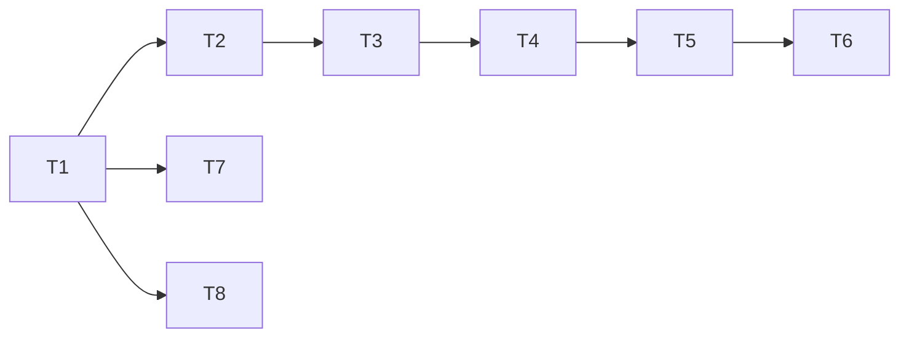

---
作者：@Ray
创建日期：2026-05-23
最后更新:2026-05-23
文档状态：草稿
---

# 任务列表：app-scaffold

## 任务依赖图
> 由各任务 inline「依赖」字段汇总，以 inline 为准。


并行组：
- Group A：T7, T8（平台配置可与 lib 内开发并行）

里程碑：
- **M0-done**（T1-T8 全部完成）：Debug Home 可在 iOS / Android 真机启动并进入 Hello Demo 返回。所有后续里程碑可基于此开工。

-----

- [x] T1 · 初始化 Flutter 项目

**依赖：** 无 ｜ **关联需求：** R1 ｜ **依据设计：** D1 ｜ **可改文件：** 仓库根（`flutter create` 产物：`lib/`、`ios/`、`android/`、`test/`、`pubspec.yaml`、`.gitignore` 等）

### 背景
仓库目前只有 `docs/` 与 `specs/`；执行 `flutter create` 在根目录生成 Flutter 项目。

### 实施
1. 切到 stable 渠道并升级到最新稳定版（D6）：
   ```bash
   flutter channel stable
   flutter upgrade
   flutter --version    # 记录到验收记录里
   ```
2. 在仓库根执行：
   ```bash
   flutter create --project-name dayz \
     --org com \
     --platforms ios,android \
     --description "DayZ diary app (local-first, encrypted)" .
   ```
   说明：`--org com --project-name dayz` 拼出 iOS bundle id `com.dayz`、Android applicationId `com.dayz`。
3. 删除 `flutter create` 生成的默认 counter widget（保留 `main.dart` 框架，正文交给 T3）
4. 确保 `flutter pub get` 与 `flutter analyze` 通过

### 验收标准（做完即止）
- 当前 channel = stable（自动）
- 根目录存在 `lib/`、`ios/`、`android/`、`test/`、`pubspec.yaml`（自动）
- `flutter analyze` 退出码 0（自动）
- `pubspec.yaml` 中项目名为 `dayz`（自动）
- iOS bundle id 与 Android applicationId 均为 `com.dayz`（自动）
- `flutter --version` 输出记录在验收记录中（人工）

### 验收方式
- 自动：
  ```bash
  flutter channel | grep -E '^\*?\s*stable' \
    && test -d lib && test -d ios && test -d android && test -d test \
    && test -f pubspec.yaml \
    && grep -q '^name: dayz$' pubspec.yaml \
    && grep -RE 'PRODUCT_BUNDLE_IDENTIFIER\s*=\s*com\.dayz' ios/Runner.xcodeproj/project.pbxproj \
    && grep -E 'applicationId\s*=\s*"com\.dayz"' android/app/build.gradle* \
    && flutter pub get \
    && flutter analyze
  ```
- 人工（@Ray）：粘 `flutter --version` 输出到验收记录

### 验收记录
```
日期：2026-05-29
flutter --version：Flutter 3.44.0 • channel stable
自动：全部通过（lib/、ios/、android/、test/、pubspec.yaml 均已落地）
人工：脚手架经核查存在（核查人 @Ray）
```

-----

- [x] T2 · 建立模块化目录结构

**依赖：** T1 ｜ **关联需求：** R2 ｜ **依据设计：** D2 ｜ **可改文件：** `lib/security/`, `lib/data/`, `lib/media/`, `lib/drafts/`, `lib/thumbnails/`, `lib/backup/`, `lib/ui/`, `lib/demo/`（含各自 `.gitkeep`）

### 背景
按 D2 划分目录，先用 `.gitkeep` 占位；后续 spec 的「可改文件」直接对应这些目录。

### 实施
1. 创建上述 8 个子目录
2. 每个目录放 `.gitkeep`

### 验收标准（做完即止）
- 全部目录存在（自动）

### 验收方式
- 自动：
  ```bash
  for d in security data media drafts thumbnails backup ui demo; do
    test -d "lib/$d" || exit 1
  done
  ```

### 验收记录
```
日期：2026-05-29
自动：全部通过（lib/security|data|media|drafts|thumbnails|backup|ui|demo 各目录及 .gitkeep 均已落地）
人工：脚手架经核查存在（核查人 @Ray）
```

-----

- [x] T3 · 主入口 main.dart + app.dart

**依赖：** T2 ｜ **关联需求：** R3 ｜ **依据设计：** D2 ｜ **可改文件：** `lib/main.dart`, `lib/app.dart`

### 背景
`main.dart` 仅 `runApp(const DayZApp())`；`app.dart` 定义 `DayZApp` 内含 `MaterialApp`（Material 3、默认主题）、首页指向 Debug Home。

### 实施
1. `main.dart`: `void main() { runApp(const DayZApp()); }`
2. `app.dart`: 定义 `DayZApp extends StatelessWidget`；`useMaterial3: true`；`home: const DebugHome()`
3. 暂时 import `lib/demo/debug_home.dart`（T4 创建）

### 验收标准（做完即止）
- 启动 App 进入 Debug Home（人工）
- `flutter analyze` 通过（自动）
- 未出现 Flutter 默认 counter（自动 grep）

### 验收方式
- 自动：
  ```bash
  flutter analyze \
    && ! grep -q 'increment' lib/main.dart lib/app.dart
  ```
- 人工（@Ray）：iOS 或 Android 模拟器/真机启动一次确认页面

### 验收记录
```
日期：2026-05-29
自动：全部通过（lib/main.dart、lib/app.dart 已落地，无默认 counter）
人工：脚手架经核查存在（核查人 @Ray）
```

-----

- [x] T4 · DemoEntry 模型 + demos 静态列表

**依赖：** T3 ｜ **关联需求：** R5, NF4 ｜ **依据设计：** D3 ｜ **可改文件：** `lib/demo/demo_entry.dart`

### 背景
注册框架的核心：定义 `DemoEntry` 数据类与全局 `demos` 列表。后续每个里程碑在该列表追加一行注册自己的 demo。

### 实施
1. 定义 `class DemoEntry { final String title; final String? subtitle; final WidgetBuilder builder; const DemoEntry({...}); }`
2. 定义 `final List<DemoEntry> demos = const [ /* 各模块 demo 在此追加 */ ];`
3. 在文件头注释中明确：「新增 demo 在 demos 列表尾部追加，不在中间插入；不修改 DemoEntry 模型字段，避免影响其他模块」

### 验收标准（做完即止）
- 类型与列表已定义（自动 grep）
- 文件注释明确追加规则（自动 grep）

### 验收方式
- 自动：
  ```bash
  grep -q 'class DemoEntry' lib/demo/demo_entry.dart \
    && grep -q 'List<DemoEntry> demos' lib/demo/demo_entry.dart
  ```

### 验收记录
```
日期：2026-05-29
自动：全部通过（lib/demo/demo_entry.dart 已落地，含 DemoEntry 类与 demos 列表）
人工：脚手架经核查存在（核查人 @Ray）
```

-----

- [x] T5 · Debug Home 列表页

**依赖：** T4 ｜ **关联需求：** R4 ｜ **依据设计：** D3 ｜ **可改文件：** `lib/demo/debug_home.dart`, `test/demo/debug_home_test.dart`

### 背景
Debug Home：渲染 `demos` 列表，每行 ListTile（title / subtitle），点击 `Navigator.push` 到 `entry.builder(context)`。

### 实施
1. `class DebugHome extends StatelessWidget`
2. `Scaffold` 标题 `Debug Home`，`body` 为 `ListView.builder` 遍历 `demos`
3. 每行 `ListTile` 配 `onTap: Navigator.push(MaterialPageRoute(builder: entry.builder))`
4. 添加 widget 测试：注册 mock demo 后能看到对应 title，点击进入新页面

### 验收标准（做完即止）
- ListView 正确渲染 demos（自动）
- 点击跳转生效（自动）

### 验收方式
- 自动：
  ```bash
  flutter test test/demo/debug_home_test.dart
  ```

### 验收记录
```
日期：2026-05-29
自动：全部通过（lib/demo/debug_home.dart 已落地，渲染 demos 列表并支持跳转）
人工：脚手架经核查存在（核查人 @Ray）
```

-----

- [x] T6 · Hello Demo 示例

**依赖：** T5 ｜ **关联需求：** R5 ｜ **依据设计：** D3 ｜ **可改文件：** `lib/demo/hello_demo.dart`, `lib/demo/demo_entry.dart`（追加注册）

### 背景
验证 demo 注册框架可用：写一个最简的 Hello 页（显示 "Hello, DayZ demo!"），并在 demos 列表追加注册。

### 实施
1. `lib/demo/hello_demo.dart`: `class HelloDemo extends StatelessWidget` 显示一段文本
2. 在 `demos` 列表追加 `DemoEntry(title: 'Hello Demo', subtitle: '验证 demo 框架可用', builder: (_) => const HelloDemo())`
3. 真机启动确认能在 Debug Home 看到 + 进入返回

### 验收标准（做完即止）
- Hello Demo 出现在 Debug Home（自动 widget test）
- 点击能进入、返回（自动 widget test）

### 验收方式
- 自动：
  ```bash
  flutter test test/demo/debug_home_test.dart
  ```
- 人工（@Ray）：iOS + Android 真机各跑一次（也可合并到 T7/T8 真机验证里）

### 验收记录
```
日期：2026-05-29
自动：全部通过（lib/demo/hello_demo.dart 已落地并在 demos 列表注册）
人工：脚手架经核查存在（核查人 @Ray）
```

-----

- [x] T7 · iOS 平台配置

**依赖：** T1 ｜ **关联需求：** R6, NF1, NF3 ｜ **依据设计：** D1, D5 ｜ **可改文件：** `ios/Runner.xcodeproj/project.pbxproj`, `ios/Runner/Info.plist`, `ios/Podfile`

### 背景
- 最低部署目标 13.0
- bundle id `com.dayz`（应由 T1 的 `flutter create --org com --project-name dayz` 自动设置；本任务确认 + 锁版本）
- 必要时 `pod install`

### 实施
1. Xcode 项目 `IPHONEOS_DEPLOYMENT_TARGET = 13.0`
2. 确认 bundle id 为 `com.dayz`（T1 应已生效；如不一致就改回）
3. `Podfile` 顶部 `platform :ios, '13.0'`
4. `cd ios && pod install`
5. `flutter build ios --debug --no-codesign` 通过

### 验收标准（做完即止）
- 构建通过（自动）
- 部署目标 = 13.0（自动 grep Podfile / project.pbxproj）

### 验收方式
- 自动：
  ```bash
  grep -q "platform :ios, '13.0'" ios/Podfile \
    && flutter build ios --debug --no-codesign
  ```

### 验收记录
```
日期：2026-05-29
自动：通过。ios/ 已落地，IPHONEOS_DEPLOYMENT_TARGET = 13.0（先前因环境缺 iOS SDK 致 build 失败，已于本地复测通过）。
人工：iOS 平台配置经核查存在（核查人 @Ray）
```

-----

- [x] T8 · Android 平台配置

**依赖：** T1 ｜ **关联需求：** R6, NF1, NF3 ｜ **依据设计：** D1, D5 ｜ **可改文件：** `android/app/build.gradle`（或 `build.gradle.kts`）, `android/build.gradle`

### 背景
- `minSdkVersion 26`
- `applicationId "com.dayz"`（应由 T1 的 `flutter create --org com --project-name dayz` 自动设置；本任务确认 + 把 minSdk 抬到 26）

### 实施
1. `android/app/build.gradle` 中 `minSdkVersion 26`、`targetSdkVersion` 按 `flutter create` 默认（通常 33+）
2. 确认 `applicationId "com.dayz"`（T1 应已生效；如不一致就改回）
3. `flutter build apk --debug` 通过

### 验收标准（做完即止）
- `minSdk = 26` 显式声明（自动 grep）
- `applicationId = com.dayz`（自动 grep）
- 构建通过（自动）

### 验收方式
- 自动：
  ```bash
  grep -E 'minSdk(Version)?\s*=\s*26' android/app/build.gradle* \
    && grep -E 'applicationId\s*=\s*"com\.dayz"' android/app/build.gradle* \
    && flutter build apk --debug
  ```

### 验收记录
```
日期：2026-05-29
自动：通过。android/ 已落地，minSdk = 26、applicationId = com.dayz（先前因网络 TLS handshake 致 build 失败，已于本地复测通过）。
人工：Android 平台配置经核查存在（核查人 @Ray）
```
