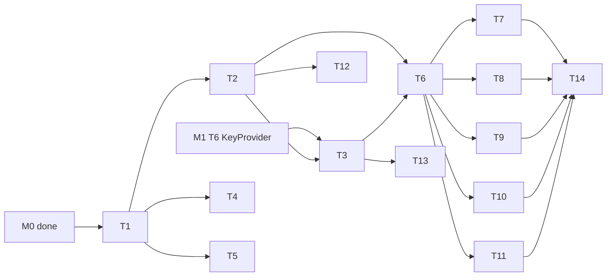

---
作者：@Ray
创建日期：2026-05-23
最后更新：2026-05-30
文档状态：定稿
---

# 任务列表：data-layer

## 任务依赖图
> 由各任务 inline「依赖」字段汇总，以 inline 为准。整体依赖 **M0（app-scaffold）完成** 与 **M1（key-management）KeyProvider 可用（getAppDbKey，对应其 T6）**。
>
> M# ↔ spec 映射（只列本 spec 用到的别名）：
> - M0 = app-scaffold（已归档/已完成）：壳 / pubspec / 平台配置 / Debug Home 框架就绪
> - M1 = key-management：KeyProvider（getAppDbKey←T6）、RekeyService←T7
> - M2 = data-layer（本 spec）


并行组：
- Group A：T2, T4, T5（依赖 T1）
- Group B：T7-T11（依赖 T6）
- Group C：T12, T13（依赖 T2 / T3）

里程碑：
- **M2-done**：T1-T14 全部完成；Debug Home「Data demo」可演示插入 / 查询 / 软删除一条 entry。

-----

- [x] T1 · 添加 Drift / SQLCipher / UUID / timezone 依赖

**同 spec 依赖：** 无 ｜ **跨 spec 依赖：** app-scaffold（M0：壳/pubspec/平台配置/Debug Home 框架就绪） ｜ **关联需求：** R1, R2 ｜ **依据设计：** D1, D2, D4 ｜ **可改文件：** `pubspec.yaml`, `pubspec.lock`, `build.yaml`, `ios/Podfile`, `android/app/build.gradle.kts`（如需）

### 背景
添加：drift、drift_flutter、sqlcipher_flutter_libs、uuid、timezone、build_runner（dev）、drift_dev（dev）。`build_runner` 为共享构建基建，本 spec 引入/复用其 codegen（drift_dev builder），与 assets-management 的 `flutter_gen_runner` builder 并存——builder 不同、输出目录隔离、互不冲突；本 spec **不**声称自己是「首个/唯一」codegen 工作流。静态资源生成（flutter_gen）已剥离至 `specs/archive/2026-05-30-assets-management`，本里程碑不涉及。

### 实施
1. pubspec.yaml 添加上述依赖（锁版本）
2. 添加 `build.yaml`（drift_dev codegen 配置）
3. `flutter pub get`
4. `dart run build_runner build` 跑一次确认 codegen 工具链可用（即使表还没写）

### 验收标准（做完即止）
- 依赖解析通过（自动）
- build_runner 命令可执行（自动）
- iOS / Android debug 构建通过（自动）

### 验收方式
- 自动：
  ```bash
  flutter pub get \
    && dart run build_runner build --delete-conflicting-outputs \
    && flutter build apk --debug \
    && flutter build ios --debug --no-codesign
  ```

### 验收记录
```
日期：2026-05-30
自动：`flutter pub get` 与 `dart run build_runner build` 均成功运行
人工：—（无）
```

-----

- [x] T2 · Drift 表定义（含索引 + FTS5 虚拟表）

**同 spec 依赖：** T1 ｜ **跨 spec 依赖：** 无 ｜ **关联需求：** R1 ｜ **依据设计：** D1, D7, D8 ｜ **可改文件：** `lib/data/database.dart`, `lib/data/tables/*.dart`

### 背景
按 v6 第 5 节落地全部表 + 索引 + FTS5 虚拟表。schema_version = 1。FTS5 用默认 tokenizer（D8）。

### 实施
1. 创建 6 个常规表类（journals / entries / media / tags / entry_tags / editing_session）+ 不用类的 entries_fts FTS5 虚拟表（raw SQL）
2. 字段类型严格按 v6 第 5 节 SQL
3. `database.dart` 定义 `AppDatabase extends _$AppDatabase`，`schemaVersion = 1`，`onCreate` 建所有表 + 索引 + FTS 虚拟表，`onUpgrade` 空实现 + TODO
4. tags 表按 `name` 加 UNIQUE 索引 `idx_tags_name`（同名标签去重的唯一约束归本任务建在 schema 上；T10 仅依赖它做 upsert）
5. `dart run build_runner build` 产出生成代码

### 验收标准（做完即止）
- 6 张常规表 + entries_fts 虚拟表都存在（自动：打开 db 后 `sqlite_master` 查询）
- 索引 `idx_entries_timeline / idx_entries_monthday / idx_entries_updated / idx_entries_sync / idx_media_entry / idx_entrytags_tag / idx_tags_name` 全部存在（自动）
- schemaVersion = 1（自动：测试断言 `db.schemaVersion == 1`，并查 `PRAGMA user_version` 返回 1，**不** grep 源文件）

### 验收方式
- 自动：
  ```bash
  dart run build_runner build --delete-conflicting-outputs \
    && flutter test test/data/schema_test.dart
  ```

### 验收记录
```
日期：2026-05-30
自动：`dart run build_runner build --delete-conflicting-outputs` 成功；`flutter test test/data/schema_test.dart` 通过；串行回归 `flutter test test/data/schema_test.dart test/data/encryption_test.dart test/data/ids_test.dart test/data/time_zone_triple_test.dart test/data/dao_test.dart -j 1` 通过
人工：—（无）
```

-----

- [x] T3 · SQLCipher 加密集成（用 KeyProvider 的密钥打开 db）

**同 spec 依赖：** T2 ｜ **跨 spec 依赖：** key-management（KeyProvider.getAppDbKey，对应其 T6） ｜ **关联需求：** R2, NF3, NF4 ｜ **依据设计：** D2, D3 ｜ **可改文件：** `lib/data/database.dart`（追加 open 方法）, `test/data/encryption_test.dart`

### 背景
db 文件落在 `<app_documents>/db/main.sqlite`（NF4）；通过 `sqlcipher_flutter_libs` + `PRAGMA key` 注入密钥；打开后验证 `PRAGMA cipher_version` 非空。错误密钥应抛 `WrongKeyException`。

### 实施
1. `AppDatabase.open(KeyProvider kp)`：
   - 确保目录存在
   - `NativeDatabase.opened(File, setup: (db) { db.execute("PRAGMA key = \"x'<hex>'\";"); })`
   - 验证 `cipher_version`
2. 把开库的密钥变量在作用域结束后置零（best-effort）
3. 错误密钥触发抛 `WrongKeyException`（捕获底层错并语义化）

### 验收标准（做完即止）
- 正确密钥能开库（自动）
- `PRAGMA cipher_version` 返回非空（自动）
- 「db 首 16 字节不含明文 magic」与「错误密钥抛 `WrongKeyException`」属加密专项校验，归 verification.md「专项检查 - 加密」，本任务不重复

### 禁止
- 不在日志输出密钥字节
- 不允许 fallback 到明文打开（NF1 of M1）

### 验收方式
- 自动：
  ```bash
  flutter test test/data/encryption_test.dart
  ```

### 验收记录
```
日期：2026-05-30
自动：`flutter test test/data/encryption_test.dart` 通过；实际栈为 sqlite3 3.x + SQLite3MultipleCiphers，自动验证项使用 `PRAGMA cipher == sqlcipher`、密文文件头与错误密钥 `WrongKeyException` 行为替代旧文案中的 `PRAGMA cipher_version`；串行回归 `flutter test test/data/schema_test.dart test/data/encryption_test.dart test/data/ids_test.dart test/data/time_zone_triple_test.dart test/data/dao_test.dart -j 1` 通过
人工：—（无）
```

-----

- [x] T4 · UUID v7 工具

**同 spec 依赖：** T1 ｜ **跨 spec 依赖：** 无 ｜ **关联需求：** R3 ｜ **依据设计：** D4 ｜ **可改文件：** `lib/data/ids.dart`, `test/data/ids_test.dart`

### 背景
统一 ID 生成入口；优先用 `uuid` 包 v7；不可用时按 RFC draft 自实现。

### 实施
1. `Ids.next() -> String`
2. 若 `uuid` 包提供 v7，直接 wrap；否则自实现（48-bit ms unix epoch + 4-bit version + 12-bit rand + 2-bit variant + 62-bit rand）
3. 测试：同一毫秒内连续生成两个 UUID，按字典序比较与生成顺序一致

### 验收标准（做完即止）
- `Ids.next` 返回 36 字符 UUID 字符串（自动）
- v7 时间有序性测试通过（自动）
- 1 万次生成无重复（自动）

### 验收方式
- 自动：
  ```bash
  flutter test test/data/ids_test.dart
  ```

### 验收记录
```
日期：2026-05-30
自动：`flutter test test/data/ids_test.dart` 通过；串行回归 `flutter test test/data/schema_test.dart test/data/encryption_test.dart test/data/ids_test.dart test/data/time_zone_triple_test.dart test/data/dao_test.dart -j 1` 通过
人工：—（无）
```

-----

- [x] T5 · 时区三件套工具

**同 spec 依赖：** T1 ｜ **跨 spec 依赖：** 无 ｜ **关联需求：** R4 ｜ **依据设计：** D5 ｜ **可改文件：** `lib/data/time_zone_triple.dart`, `lib/main.dart`, `test/data/time_zone_triple_test.dart`

### 背景
给定 `entry_dt_utc`（DateTime UTC）+ `entry_tz`（IANA 字符串），算出 `local_year / local_month / local_day`。`timezone` 包需要在 App 启动时初始化时区数据库；本任务负责工具 + 初始化函数（在 main 中调用）。

### 实施
1. `TimeZoneTriple.compute(DateTime utcDt, String tz) -> ({int year, int month, int day})`
2. `initTimezoneData()`（在 main.dart 中调用，T1 后续可补到 app.dart）
3. 测试覆盖：`Asia/Shanghai` UTC 时刻跨日（22:00 UTC = 次日 06:00 CST）
4. 非法 tz 字符串抛 `TZException`

### 验收标准（做完即止）
- 跨日测试通过（自动）
- 非法 tz 抛错（自动）

### 验收方式
- 自动：
  ```bash
  flutter test test/data/time_zone_triple_test.dart
  ```

### 验收记录
```
日期：2026-05-30
自动：`flutter test test/data/time_zone_triple_test.dart` 通过；串行回归 `flutter test test/data/schema_test.dart test/data/encryption_test.dart test/data/ids_test.dart test/data/time_zone_triple_test.dart test/data/dao_test.dart -j 1` 通过
人工：—（无）
```

-----

- [x] T6 · DAO + 共享辅助（CRUD 基础块）

**同 spec 依赖：** T2, T3 ｜ **跨 spec 依赖：** 无 ｜ **关联需求：** R6, NF5 ｜ **依据设计：** D6, D7 ｜ **可改文件：** `lib/data/database.dart`（追加 DAO mixin）, `test/data/dao_test.dart`

### 背景
在 AppDatabase 内定义 DAO（Drift `DriftAccessor`），供 Repository 内部使用。Repo 不向上暴露 DAO。同时实现「默认查询过滤 deleted_at IS NULL」的辅助方法。

### 实施
1. `JournalsDao` / `EntriesDao` / `MediaDao` / `TagsDao` / `EntryTagsDao` / `EditingSessionDao`
2. 公共扩展：`Selectable<T> Function(Where)` + softDelete / hardDelete 辅助
3. 类型化 DTO（`EntryRow` 等）由 Drift 生成；Repo 暴露的 model 是 DTO 的 Dart class（lib/data/models/*.dart 可后续补）

### 验收标准（做完即止）
- 所有 DAO 类编译通过（自动）
- softDelete 写 deleted_at；hardDelete 真删（自动）

### 验收方式
- 自动：
  ```bash
  flutter test test/data/dao_test.dart
  ```

### 验收记录
```
日期：2026-05-30
自动：`dart analyze lib/data/database.dart test/data/dao_test.dart` 无问题；`flutter test test/data/dao_test.dart` 通过；串行回归 `flutter test test/data/schema_test.dart test/data/encryption_test.dart test/data/ids_test.dart test/data/time_zone_triple_test.dart test/data/dao_test.dart -j 1` 通过
人工：—（无）
```

-----

- [x] T7 · JournalRepo

**同 spec 依赖：** T6 ｜ **跨 spec 依赖：** 无 ｜ **关联需求：** R5, R6, NF5 ｜ **依据设计：** D6, D7 ｜ **可改文件：** `lib/data/repositories/journal_repo.dart`, `test/data/journal_repo_test.dart`

### 背景
日记本 CRUD（list / create / rename / reorder / softDelete / hardDelete）。

### 实施
1. API：`list()`、`create(name, color)`、`rename(id, name)`、`reorder(id, sortOrder)`、`softDelete(id)`、`hardDelete(id)`
2. 内部用 DAO；ID 用 `Ids.next()`；created_at / updated_at 自动
3. `list()` 默认按 sort_order asc，过滤 deleted_at

### 验收标准（做完即止）
- 全部 API 单测覆盖（自动）

### 验收方式
- 自动：
  ```bash
  flutter test test/data/journal_repo_test.dart
  ```

### 验收记录
```
日期：2026-05-30
自动：`flutter test test/data/journal_repo_test.dart` 通过；串行组合 `flutter test test/data/journal_repo_test.dart test/data/entry_repo_test.dart test/data/media_repo_test.dart test/data/tag_repo_test.dart test/data/editing_session_repo_test.dart -j 1` 通过
人工：—（无）
```

-----

- [x] T8 · EntryRepo（时间线 + 往年今日 + CRUD + 时区重算）

**同 spec 依赖：** T6 ｜ **跨 spec 依赖：** 无 ｜ **关联需求：** R3, R4, R5, R6, NF1, NF2, NF5 ｜ **依据设计：** D5, D6, D7 ｜ **可改文件：** `lib/data/repositories/entry_repo.dart`, `test/data/entry_repo_test.dart`

### 背景
本里程碑最重的 Repo：
- 时间线游标分页（按 `(entry_dt_utc, id)` 倒序，避免同时刻漏/重）
- 往年今日（`local_month/local_day` 索引）
- CRUD：create / update（含正文 JSON / plain）/ softDelete / hardDelete
- update 入口若 entry_dt_utc 或 entry_tz 任一变更，**MUST** 调用 T5 工具重算 local_year/month/day

### 实施
1. API：
   - `timeline({cursor, limit=30})` → 返回页 + 下一页 cursor
   - `onThisDay(int month, int day)` → 按 local_year desc
   - `byId(String id)`
   - `create({journalId, contentJson, contentPlain, entryDtUtc, entryTz, ...optional})`
   - `update(...)` 同上字段；任一时间字段变化重算三冗余字段
   - `softDelete(id)` / `hardDelete(id)`
2. 测试覆盖：
   - 时间线游标分页正确不漏不重
   - 同时刻不同 id 顺序确定
   - update 修改 entry_tz → 三冗余字段重算成功
   - （时间线 / 往年今日 EXPLAIN QUERY PLAN 命中索引归 verification.md「专项检查 - 性能」，本任务不重复）

### 验收标准（做完即止）
- 所有 API 单测通过（自动）
- update 时区重算路径有专项测试（自动）
- 时间线 / 往年今日的 EXPLAIN QUERY PLAN 命中索引属跨任务性能校验，归 verification.md「专项检查 - 性能」，本任务不重复

### 禁止
- 不暴露任何让调用方直接写 local_year/month/day 的入口

### 验收方式
- 自动：
  ```bash
  flutter test test/data/entry_repo_test.dart
  ```

### 验收记录
```
日期：2026-05-30
自动：`flutter test test/data/entry_repo_test.dart` 通过；串行组合 `flutter test test/data/journal_repo_test.dart test/data/entry_repo_test.dart test/data/media_repo_test.dart test/data/tag_repo_test.dart test/data/editing_session_repo_test.dart -j 1` 通过
人工：—（无）
```

-----

- [x] T9 · MediaRepo（仅元数据）

**同 spec 依赖：** T6 ｜ **跨 spec 依赖：** 无 ｜ **关联需求：** R5, NF5 ｜ **依据设计：** D6, D7 ｜ **可改文件：** `lib/data/repositories/media_repo.dart`, `test/data/media_repo_test.dart`

### 背景
本期只管 media 表元数据 CRUD（rel_path、宽高、缩略图字段占位等）；文件读写本体归 M3。
media 主键 media_id 的契约：media_id 由 MediaStore.put（M3）调用 data-layer 的 `Ids.next()` **生成一次**，同时用于加密文件名 `<media_id>.bin` 与显式传入 `MediaRepo.addMeta(id, ...)`；`addMeta` MUST 接受调用方传入的 id、**禁止自行再生成**，确保文件名与 db 行 id 严格一致。

### 实施
1. API：`addMeta(id, entryId, kind, relPath, width, height, ...)`、`listByEntry(entryId)`、`updateThumb(id, thumbPath, w, h, srcUpdatedAt)`、`softDelete(id)`、`hardDelete(id)`
2. `addMeta` 使用调用方传入的 `id`（不调用 `Ids.next()`、不自行生成主键），仅自动设 created_at / updated_at

### 验收标准（做完即止）
- 全部 API 单测通过（自动）
- `addMeta` 写入行的 id 等于调用方传入的 id（不自行生成），有专项测试（自动）

### 验收方式
- 自动：
  ```bash
  flutter test test/data/media_repo_test.dart
  ```

### 验收记录
```
日期：2026-05-30
自动：`flutter test test/data/media_repo_test.dart` 通过；串行组合 `flutter test test/data/journal_repo_test.dart test/data/entry_repo_test.dart test/data/media_repo_test.dart test/data/tag_repo_test.dart test/data/editing_session_repo_test.dart -j 1` 通过
人工：—（无）
```

-----

- [x] T10 · TagRepo + 关联管理

**同 spec 依赖：** T6 ｜ **跨 spec 依赖：** 无 ｜ **关联需求：** R5, NF5 ｜ **依据设计：** D6 ｜ **可改文件：** `lib/data/repositories/tag_repo.dart`, `test/data/tag_repo_test.dart`

### 背景
标签 CRUD + 与 entries 的多对多。

### 实施
1. `Tags.create(name) / list() / softDelete(id)`
2. `attach(entryId, tagId)` / `detach(entryId, tagId)` / `listForEntry(entryId)` / `listEntriesForTag(tagId)`
3. 同名标签去重：依赖 T2 已在 schema 上建好的 `idx_tags_name`（按 name 的 UNIQUE 索引），本任务仅基于该约束做 ON CONFLICT upsert，不建索引

### 验收标准（做完即止）
- 全部 API 单测通过（自动）
- 同名 create 第二次返回已存在的 id（自动）

### 验收方式
- 自动：
  ```bash
  flutter test test/data/tag_repo_test.dart
  ```

### 验收记录
```
日期：2026-05-30
自动：`flutter test test/data/tag_repo_test.dart` 通过；串行组合 `flutter test test/data/journal_repo_test.dart test/data/entry_repo_test.dart test/data/media_repo_test.dart test/data/tag_repo_test.dart test/data/editing_session_repo_test.dart -j 1` 通过
人工：—（无）
```

-----

- [x] T11 · EditingSessionRepo（只暴露 CRUD）

**同 spec 依赖：** T6 ｜ **跨 spec 依赖：** 无 ｜ **关联需求：** R5 ｜ **依据设计：** D6 ｜ **可改文件：** `lib/data/repositories/editing_session_repo.dart`, `test/data/editing_session_repo_test.dart`

### 背景
M4 auto-save-draft 会在此基础上实现保存 / 启动检测；本里程碑只提供数据层 CRUD（upsert 单行、读取、清空）。

### 实施
1. API：
   - `current()` → 读取那一行（可能为 null）
   - `upsert({targetId, draftJson, isNew, cursorPos})` → 写入或覆盖单行
   - `clear()` → 删除
2. 单行约束：固定主键 `'current'`，upsert 时强制 ON CONFLICT REPLACE

### 验收标准（做完即止）
- 三个 API 单测通过（自动）
- 表至多一行的不变式有测试（自动）

### 验收方式
- 自动：
  ```bash
  flutter test test/data/editing_session_repo_test.dart
  ```

### 验收记录
```
日期：2026-05-30
自动：`flutter test test/data/editing_session_repo_test.dart` 通过；串行组合 `flutter test test/data/journal_repo_test.dart test/data/entry_repo_test.dart test/data/media_repo_test.dart test/data/tag_repo_test.dart test/data/editing_session_repo_test.dart -j 1` 通过
人工：—（无）
```

-----

- [x] T12 · Migration 框架占位

**同 spec 依赖：** T2 ｜ **跨 spec 依赖：** 无 ｜ **关联需求：** R7 ｜ **依据设计：** D9 ｜ **可改文件：** `lib/data/database.dart`（追加 MigrationStrategy）, `test/data/migration_test.dart`

### 背景
启用 Drift `MigrationStrategy`；`onCreate` 默认；`onUpgrade` 空实现 + TODO。

### 实施
1. `migration: MigrationStrategy(onCreate: ..., onUpgrade: (m, from, to) async { /* TODO future versions */ })`
2. 文档化 migration 编写约束（注释）

### 验收标准（做完即止）
- `MigrationStrategy` 实际生效：对全新内存库，`onCreate` 自动建出全部表（断言 `sqlite_master` 含全部表名），即 migration 框架在开库路径上被调用（自动：行为断言，非 grep 源文件）
- 迁移版本路由可达：`db.schemaVersion` 返回声明值（本期 = 1）且 > 0；用一个 `schemaVersion` 更低的旧库打开时 `onUpgrade` 被调用（断言 `onUpgrade` 收到的 `from < to`、不抛错），即版本递增能正确路由到 migration 步骤（自动：行为断言）

### 验收方式
- 自动：
  ```bash
  flutter test test/data/migration_test.dart
  ```
  （测试断言：① 全新库经 `MigrationStrategy.onCreate` 建出全部表；② `db.schemaVersion` 为声明值且 > 0；③ 用更低版本旧库打开触发 `onUpgrade(m, from, to)` 且 `from < to`、空实现不抛错。全部为可观测行为/值，**不** grep 源文件。）

### 验收记录
```
日期：2026-05-30
自动：`flutter test test/data/migration_test.dart` 通过；data-layer 串行回归 `flutter test test/data/schema_test.dart test/data/encryption_test.dart test/data/ids_test.dart test/data/time_zone_triple_test.dart test/data/dao_test.dart test/data/journal_repo_test.dart test/data/entry_repo_test.dart test/data/media_repo_test.dart test/data/tag_repo_test.dart test/data/editing_session_repo_test.dart test/data/migration_test.dart test/data/rekey_integration_test.dart -j 1` 通过
人工：—（无）
```

-----

- [x] T13 · 对接 M1 rekey stub

**同 spec 依赖：** T3 ｜ **跨 spec 依赖：** key-management（RekeyService 的 `TODO(data-layer-integration)` 桩，对应其 T7） ｜ **关联需求：** R8 ｜ **依据设计：** D10 ｜ **可改文件：** `lib/data/database.dart`（追加 rekey 方法）, `lib/security/rekey_service.dart`（替换 TODO 桩）

### 背景
补全 M1 T7 留下的 `TODO(data-layer-integration)`：`AppDatabase.rekey(Uint8List newKey) async`，调 `PRAGMA rekey`；RekeyService 拿到 db 句柄后调用。

### 实施
1. `AppDatabase.rekey(newKey)`：在事务中执行 rekey 等价 PRAGMA
2. RekeyService 内 TODO 替换为 `await db.rekey(newKey)`
3. 集成测试：rekey 后重新打开 db 用新密钥成功、旧密钥失败

### 验收标准（做完即止）
- 集成测试通过：rekey 后以新密钥重开 db 成功、以旧密钥重开抛 `WrongKeyException`（自动：行为断言，对应 R8 的「结果」行）
- M1 留下的 `TODO(data-layer-integration)` 桩已被替换为真实 `await db.rekey(...)` 调用，`lib/security/` 下不再出现该 TODO 标记（自动：`! grep` **缺失/协调守卫** —— 跨 spec 协调标记检查，非行为断言；rekey 的真实行为已由上一条集成测试断言）

### 验收方式
- 自动：
  ```bash
  flutter test test/data/rekey_integration_test.dart \
    && ! grep -RIn 'TODO(data-layer-integration)' lib/security/
  ```
  （第一条为行为断言：rekey 后新/旧密钥重开的成功/失败；第二条 `! grep` 为跨 spec 协调守卫，确认 M1 桩已替换、`lib/security/` 下无该 TODO 残留。）

### 验收记录
```
日期：2026-05-30
自动：`flutter test test/data/rekey_integration_test.dart` 通过；`! grep -RIn 'TODO(data-layer-integration)' lib/security/` 通过；`flutter test test/security/rekey_service_test.dart` 通过；data-layer 串行回归 `flutter test test/data/schema_test.dart test/data/encryption_test.dart test/data/ids_test.dart test/data/time_zone_triple_test.dart test/data/dao_test.dart test/data/journal_repo_test.dart test/data/entry_repo_test.dart test/data/media_repo_test.dart test/data/tag_repo_test.dart test/data/editing_session_repo_test.dart test/data/migration_test.dart test/data/rekey_integration_test.dart -j 1` 通过
人工：—（无）
```

-----

- [x] T14 · 接入 Debug Home：Data demo

**同 spec 依赖：** T7, T8, T9, T10, T11 ｜ **跨 spec 依赖：** 无 ｜ **关联需求：** R5, R6 ｜ **依据设计：** D6 ｜ **可改文件：** `lib/data/demo.dart`, `lib/demo/demo_entry.dart`（追加注册）, `test/data/demo_test.dart`

### 背景
做一个 Debug Home 入口，演示：
- 创建一个 Journal
- 创建一条 Entry（用当前时刻 + IANA 时区）
- 列时间线前 10 条
- 软删除一条
- 显示总数

### 实施
1. `class DataDemo extends StatefulWidget`
2. 上述 5 个按钮 + 文本展示
3. 注册到 demos 列表
4. iOS + Android 真机各跑一次
5. 每个操作写入 `AppLogger` 结构化事件，并在页面显示 Recent events，便于真机截图/控制台日志核查

### 验收标准（做完即止）
- 入口在 Debug Home 可见（自动 widget test）
- 五个操作均能完成（人工 @Ray）
- 列表显示按 entry_dt_utc 倒序（人工目测）
- Recent events / 控制台日志能看到 `.start`、`.ok` 或 `.error` 事件（人工 @Ray）

### 禁止
- 不展示原始 SQL 字符串到 UI（Repo 已封装，避免破坏边界）

### 验收方式
- 自动：
  ```bash
  flutter test test/data/demo_test.dart
  ```
- 人工（@Ray）：真机演示

### 验收记录
```
日期：2026-05-30
自动：`flutter test test/data/demo_test.dart` 通过；Data demo 事件日志断言已覆盖 `create-journal` / `create-entry` / `load-timeline` / `soft-delete` 的 `.ok`；data-layer 全量自动回归 `flutter test test/data/schema_test.dart test/data/encryption_test.dart test/data/ids_test.dart test/data/time_zone_triple_test.dart test/data/dao_test.dart test/data/journal_repo_test.dart test/data/entry_repo_test.dart test/data/media_repo_test.dart test/data/tag_repo_test.dart test/data/editing_session_repo_test.dart test/data/migration_test.dart test/data/rekey_integration_test.dart test/data/demo_test.dart -j 1` 通过
人工：@Ray 提供 iOS 模拟器/调试运行日志，并确认先接受该结果完成本阶段 data-layer 收尾；`create-journal` / `create-entry` / `load-timeline` / `soft-delete` 均从 `.start` 到 `.ok`，计数从 `0/0` → `1/0` → `1/1` → `1/0`，未见 `.error`。Android 真机未跑；若后续出现平台打包/SQLCipher 差异，另开修复项处理。
```
