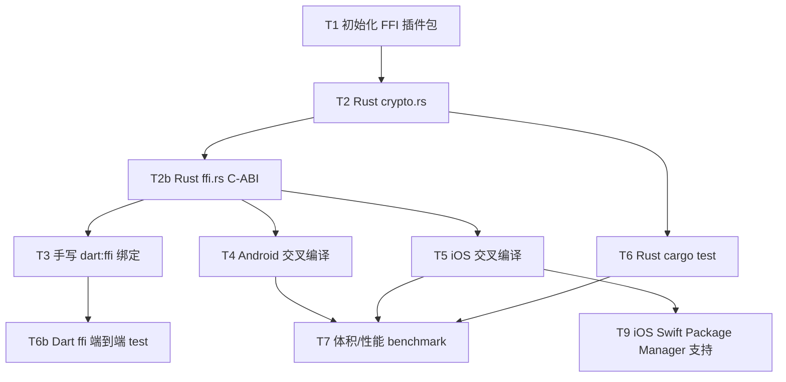

---
作者：@Ray
创建日期：2026-05-30
最后更新：2026-05-30
文档状态：草稿
---

# 任务列表：dayz-security-rust（argon2id_ffi）

> 归档口径：交付独立库 `packages/argon2id_ffi`、DayZ KDF 接入、host/iOS 模拟器/Android 模拟器
> profile-AOT 验证与实测数据。**不宣称 iOS 真机 archive/TestFlight 或 Android 真机 release 已验**；
> 真机发布闸门作为后置发布风险保留。算法正确性的权威断言下沉到 Rust `cargo test`（CI 友好、无需 Flutter）；
> Dart 层验 ffi 绑定透传。

## 任务依赖图



-----

- [x] T1 · 初始化 FFI 插件包结构与 Cargo 依赖

**关联需求：** R1, R2 ｜ **依据设计：** D1, D5 ｜ **可改文件：** `packages/argon2id_ffi/`、`rust/Cargo.toml`、`packages/CHANGELOG.md`

### 实施
1. 生成 Flutter FFI 插件骨架（cargokit + 五平台接线），组织 `com.dayz`。
2. `rust/Cargo.toml` 加 `argon2/hkdf/sha2/zeroize` + `ffi`(Dart 侧)，`crate-type=["cdylib","staticlib","lib"]`，
   release `opt-level=3,lto,strip,codegen-units=1,panic=unwind`，`release-min`(opt-z+abort) 仅供体积测量。
3. `packages/CHANGELOG.md` 自研包另起一节（不进 Patch 台账，见 D5）。

### 验收记录
```
2026-05-30 自动：flutter pub get 退出 0；cargo metadata 解析正常（87 crate，无 FRB/tokio）。
```

---

- [x] T2 · Rust 纯算法层 crypto.rs

**同 spec 依赖：** T1 ｜ **关联需求：** R1, R2, R4 ｜ **依据设计：** D3 ｜ **可改文件：** `rust/src/api/crypto.rs`、`rust/src/api/mod.rs`、`rust/src/lib.rs`

### 实施
1. `argon2id_derive_key` / `hkdf_sha256_derive_key`（`Result<Vec<u8>, String>`，收 `Vec` 所有权）。
2. 输入校验：salt≥8B、output_len∈[16,1024]（argon2）/[1,255*32]（hkdf）；非法即 `Err`。
3. 对入参 `password/ikm` **显式** `zeroize`；argon2 开 `zeroize` feature 擦内部块。

### 验收记录
```
2026-05-30 自动：cargo build/clippy --lib 无警告。
```

---

- [x] T2b · Rust C-ABI 包装 ffi.rs

**同 spec 依赖：** T2 ｜ **关联需求：** R1, R2, R4 ｜ **依据设计：** D4 ｜ **可改文件：** `rust/src/api/ffi.rs`、`rust/src/api/mod.rs`

### 实施
1. `#[no_mangle] extern "C"` 的 `argon2id_ffi_derive` / `hkdf_sha256_ffi_derive`，返回 i32 错误码。
2. 内存契约：调用方分配 out、传 ptr+len，Rust 只写入不分配；入参 `*const u8` 只读借用。
3. 整体 `std::panic::catch_unwind` 收口（panic→-100，绝不跨 FFI）；`#[used]` 锚点防 dead-strip。

### 验收记录
```
2026-05-30 自动：cargo build --release 后 nm -gU 仅 2 导出符号（argon2id_ffi_derive / hkdf_sha256_ffi_derive）。
```

---

- [x] T3 · 手写 dart:ffi 绑定 + 异步 API

**同 spec 依赖：** T2b ｜ **关联需求：** R1, R2 ｜ **依据设计：** D2 ｜ **可改文件：** `lib/src/ffi/{bindings,errors,crypto_ffi}.dart`、`lib/argon2id_ffi.dart`、`pubspec.yaml`

### 实施
1. `bindings.dart`：typedef + `openLib`(平台分流 + `ARGON2ID_FFI_LIB` host 逃生通道) + `lookupFunction`。
2. `errors.dart`：错误码 → `Argon2idFfiException`。
3. `crypto_ffi.dart`：公开异步 `argon2idDeriveKey` / `hkdfSha256DeriveKey`，`Isolate.run` 内 open+调用+marshalling+free。

### 验收记录
```
2026-05-30 自动：dart analyze lib 无问题；签名为 Future<Uint8List>。行为正确性见 T6b。
```

---

- [x] T4 · Android arm64 交叉编译（产物级断言）

**同 spec 依赖：** T2b ｜ **关联需求：** R3, NF2 ｜ **依据设计：** D2 ｜ **可改文件：** `android/`、`rust/`

### 实施 / 验收
- NDK 链接器 + `CC_aarch64_linux_android` 交叉编译 cdylib，断言 `.so` 存在、记录字节（NF2）。

### 验收记录
```
2026-05-30 自动：Android arm64 .so 0.333MB（349,528B），见 BENCHMARK.md §3。
```

---

- [x] T5 · iOS arm64 交叉编译（产物级断言）

**同 spec 依赖：** T2b ｜ **关联需求：** R3, NF2 ｜ **依据设计：** D2 ｜ **可改文件：** `ios/`（cargokit 的 `argon2id_ffi.podspec` `-force_load` + `Classes/dummy_file.c`）、`rust/`

### 实施 / 验收
- 交叉编译 `aarch64-apple-ios`(真机) + `aarch64-apple-ios-sim`(模拟器)，记录 cdylib 字节。
- release/archive 符号留存属真机集成项（debug 假绿），移到 verification 兼容性专项。

### 验收记录
```
2026-05-30 自动：iOS arm64 + sim 构建成功；arm64 cdylib 0.317MB（332,552B），见 BENCHMARK.md §3。
```

---

- [x] T6 · Rust cargo test（算法正确性，CI 友好）

**同 spec 依赖：** T2 ｜ **关联需求：** R1, R2, R4 ｜ **依据设计：** D3 ｜ **可改文件：** `rust/src/api/crypto.rs`（`#[cfg(test)]`）

### 实施
1. Argon2id KAT：4 组对 argon2-cffi（P-H-C C）逐字节（含空口令、len64、p2）。
2. HKDF：RFC 5869 §A Case 1/2/3（含 salt=None）。3. 确定性 + 输入校验拒绝。

### 验收记录
```
2026-05-30 自动：7/7 通过（4 Argon2id KAT vs argon2-cffi 25.1.0 + 3 RFC5869 HKDF + 确定性 + 校验）。
```

---

- [x] T6b · Dart 手写 ffi 端到端 test

**同 spec 依赖：** T3 ｜ **关联需求：** R1, R2 ｜ **依据设计：** D2 ｜ **可改文件：** `test/crypto_ffi_test.dart`

### 实施 / 验收
- host 经 `ARGON2ID_FFI_LIB` 加载 release dylib，断言 Dart→C-ABI→Rust 的 argon2 KAT、空口令边界、
  错误码抛异常、确定性、HKDF Case1/Case3 逐字节一致。

### 验收记录
```
2026-05-30 自动：6/6 通过（argon2 KAT/空口令/错误码/确定性 + HKDF Case1/Case3）。
```

---

- [x] T7 · 体积 / 性能 / 正确性 benchmark

**同 spec 依赖：** T4, T5, T6 ｜ **关联需求：** NF1, NF2 ｜ **依据设计：** D6 ｜ **可改文件：** `rust/benches/kdf_bench.rs`、`rust/examples/timing.rs`、`scripts/bench_compare.py`、`BENCHMARK.md`

### 实施
1. 性能：Rust `examples/timing.rs`（N=11 中位，release）+ C `scripts/bench_compare.py`（argon2-cffi 同机同参）。
2. 体积：三端 cdylib（DCE+strip）字节。3. 汇总进 `BENCHMARK.md`（方法学 + 复现 + 发布前真机闸门后置）。

### 验收记录
```
2026-05-30 自动：v0 Rust 59.9ms vs C 77.2ms（快 1.29×）；cdylib iOS 0.317MB / Android 0.333MB。
人工：BENCHMARK.md 已成文；@Ray 确认本轮按模拟器口径归档，真机数后置。
```

---

- [x] T8 · 模拟器闸门 + DayZ 接入收口；真机发布闸门后置

**关联需求：** NF1, NF2, R3 ｜ **依据设计：** D6 ｜ **可改文件：** `specs/archive/2026-05-30-dayz-security-rust/{requirement,design,tasks,verification}.md`

### 实施 / 验收
1. 明确归档口径：host 正确性 + iOS 模拟器 debug + Android 模拟器 profile/AOT 足以完成本 spec；不把它写成真机发布验收。
2. DayZ KDF 接入已落地并通过 KAT / host / 模拟器验证；iOS 真机 archive/TestFlight 符号留存、Android 真机 release、
   真机整包增量与并发 OOM 作为后续发布闸门，不阻塞本 spec 归档。

### 验收记录
```
2026-05-30 自动：Rust cargo test、Dart ffi 端到端、DayZ Argon2Kdf host KAT、iOS 模拟器 debug、Android 模拟器 profile/AOT 均已有通过记录（见 verification）。
人工：@Ray 确认本轮只跑模拟器；真机/archive 不作为本 spec 归档阻塞。
```

---

- [x] T9 · iOS Swift Package Manager 支持

**同 spec 依赖：** T5 ｜ **关联需求：** R3 ｜ **依据设计：** D7 ｜ **可改文件：**
`packages/argon2id_ffi/ios/argon2id_ffi/**`、`packages/argon2id_ffi/scripts/build_ios_xcframework.sh`、
`packages/argon2id_ffi/CHANGELOG.md`、`packages/CHANGELOG.md`

### 实施
1. 新增 Flutter 约定路径 `ios/argon2id_ffi/Package.swift`，产品名为 `argon2id-ffi`，供
   `FlutterGeneratedPluginSwiftPackage` 自动依赖。
2. 新增 Rust 静态库 `argon2id_ffi.xcframework`（真机 arm64 + 模拟器 arm64/x86_64），让 SPM 构建链真正链接
   `argon2id_ffi_derive` / `hkdf_sha256_ffi_derive`，不是空包消警告。
3. 保留原 CocoaPods `script_phase + -force_load` 路径，作为未启用 SPM 与后续 macOS 的兼容通道。
4. 新增 `scripts/build_ios_xcframework.sh` 记录可复现构建命令。

### 验收记录
```
2026-05-30 自动：swift package dump-package 通过；flutter pub get 不再提示 argon2id_ffi 缺少 iOS SPM 支持；flutter build ios --simulator --debug 通过。
```
