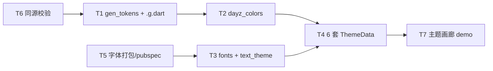

---
作者：@Ray
创建日期：2026-05-29
最后更新：2026-05-29
文档状态：定稿
---

# 任务列表：design-tokens-theme

## 任务依赖图
> 由各任务 inline「同 spec 依赖」字段汇总，以 inline 为准。



并行组：
- Group A：T6 →（gate）T1、T5、T3（T5 先于 T3 提供字体资源）
- Group B：T1 → T2
- Group C：T2 + T3 → T4
- Group D：T4 → T7

（整套主题层一体、无可独立部署/演示的中间切点 → 不设里程碑。）

-----

- [x] T1 · gen_tokens.dart 解析器 + 生成 dayz_tokens.g.dart

**同 spec 依赖：** T6 ｜ **跨 spec 依赖：** 无 ｜ **关联需求：** R2, R5, NF3 ｜ **依据设计：** D2, D1 ｜ **可改文件：** `bin/gen_tokens.dart`、`lib/ui/theme/dayz_tokens.g.dart`、`pubspec.yaml`（仅 `dev_dependencies` 段加 `csslib`）、`CLAUDE.md`（仅「常用命令」段补两条命令）｜ **验收基建：** `test/ui/theme/gen_tokens_test.dart`、`test/ui/theme/fixtures/`（对抗样例 CSS + 期望 Dart）

### 背景
解析 `ui-design/current/design-system/assets/tokens.css`（先经 T6 同源校验通过）→ 只产**纯数据**：六套 `DayzColors` 常量 + `DayzSpacing/Radii/Motion/Fonts` 静态类。行为代码不在此（归 T2）。
归属：T1 只动 `pubspec.yaml` 的 `dev_dependencies`（加 `csslib`，是生成器自身依赖、与 T5 字体打包无关）；T5 只动 `fonts:`/assets 段，互不冲突。

### 实施
1. `pubspec.yaml` 的 `dev_dependencies` 加 `csslib`（本任务自持，避免拓扑上 T1 先于字体任务跑而 import 失败）。
2. 用 `package:csslib` 解析（库原生剥注释、正确切分 `box-shadow` 中 `rgba()` 内部逗号），**不裸 `split(',')`**。
3. 值映射：`#RRGGBB`→`Color(0xFFrrggbb)`；`rgba(r,g,b,a)`→`Color(0x..)`，alpha 显式 `(a*255).round()`（半值向上，如 `0.32→0x52`）；多层 `box-shadow`→`List<BoxShadow>`（逐层 offset/blur/spread/color）；`--accent-strong`→`accentStrong`、`--sp-4`→`s4`。
4. 遇未知函数/畸形值 → 非零退出 + 定位打印（R5），不写错值。
5. 输出确定性：字段定序、无时间戳（NF3）。
6. 在 `CLAUDE.md`「常用命令」段补 `dart run bin/gen_tokens.dart`（token codegen）与 `bash scripts/check_tokens_sync.sh`（同源校验），与本任务同 commit（CLAUDE.md 维护契约，活先例 `check_patches.sh`）。

### 验收标准（做完即止）
- 对抗样例（hex / rgba / 多层 shadow / shadow 值内含逗号 / **注释内含逗号或花括号** / alpha 边界）→ 生成的 Dart 值逐项正确（自动）。
- 畸形输入 → 进程非零退出、不产出文件（自动，R5）。
- 同一输入跑两次产出逐字节一致（自动，NF3）。

### 验收方式
- 自动：
  ```bash
  flutter test test/ui/theme/gen_tokens_test.dart
  ```
  （测试喂 `fixtures/` 里的对抗 CSS、运行生成器、断言产出的 Dart **值**与期望一致 + 畸形输入非零退出 + 两次产出 diff 为空；**不** grep 生成器源码自身）

### 验收记录
```
日期：2026-05-30
自动：运行 `flutter test test/ui/theme/gen_tokens_test.dart` 测试全部成功通过。
人工：N/A
```

-----

- [x] T2 · dayz_colors.dart（DayzColors + 行为 + helper）

**同 spec 依赖：** T1 ｜ **跨 spec 依赖：** 无 ｜ **关联需求：** R1 ｜ **依据设计：** D1, D2 ｜ **可改文件：** `lib/ui/theme/dayz_colors.dart` ｜ **验收基建：** `test/ui/theme/dayz_colors_test.dart`

### 背景
手写 `DayzColors extends ThemeExtension<DayzColors>`：字段引用 T1 生成的常量；实现 `lerp`（每色 `Color.lerp`、每档阴影 `BoxShadow.lerpList`）、`copyWith`、helper getter（`glassSurface` 半透 + `fabGradient`）、`context.dayz` 扩展。

### 实施
1. 定义字段（中性色 + 强调色 7 元组 + 三档 `List<BoxShadow>`）。
2. `lerp`/`copyWith` 全字段覆盖。
3. helper：`glassSurface`（`surface.withValues(alpha:…)`，系数取自 screen.css，见 design 已知风险）、`fabGradient`（受光渐变）。
4. `extension DayzColorsX on BuildContext { DayzColors get dayz => Theme.of(this).extension<DayzColors>()!; }`。

### 验收标准（做完即止）
- `lerp(a,b,0)==a`、`lerp(a,b,1)==b`、`t=0.5` 各色为中点（自动）。
- `copyWith` 改一字段、其余不变（自动）。
- `context.dayz` 在挂了 extension 的 ThemeData 下取值非空（自动，widget test）。

### 验收方式
- 自动：
  ```bash
  flutter test test/ui/theme/dayz_colors_test.dart
  ```

### 验收记录
```
日期：2026-05-30
自动：运行 `flutter test test/ui/theme/dayz_colors_test.dart` 测试全部成功通过。
人工：N/A
```

-----

- [x] T3 · dayz_fonts.dart + dayz_text_theme.dart

**同 spec 依赖：** T5 ｜ **跨 spec 依赖：** 无 ｜ **关联需求：** R4, R6 ｜ **依据设计：** D3, D1 ｜ **可改文件：** `lib/ui/theme/dayz_fonts.dart`、`lib/ui/theme/dayz_text_theme.dart` ｜ **验收基建：** `test/ui/theme/text_theme_test.dart`

### 背景
字体栈静态类（`sans`/`serif` + 各自 `fontFamilyFallback`）+ 排版类（`.t-display/.t-h1/.t-body/.t-diary/.t-caption/.t-overline` → `TextStyle`，CJK 行高 1.7 / 日记 1.85，`leadingDistribution: even`）。

### 实施
1. `DayzFonts`：`sans='Hanken Grotesk'`、`serif='Newsreader'`、`sansFallback`/`serifFallback`（含 PingFang/Songti/Noto CJK）。
2. 排版 `TextStyle` 各类，行高/字族按 DESIGN-REF §2.4。

### 验收标准（做完即止）
- 正文 `height==1.7`、日记 `height==1.85`、`leadingDistribution==even`（自动）。
- `fontFamily` 与 `fontFamilyFallback` 取值符合 D3（自动）。

### 验收方式
- 自动:
  ```bash
  flutter test test/ui/theme/text_theme_test.dart
  ```

### 验收记录
```
日期：2026-05-30
自动：运行 `flutter test test/ui/theme/text_theme_test.dart` 测试全部成功通过。
人工：N/A
```

-----

- [x] T4 · dayz_theme.dart（六套 ThemeData 装配）

**同 spec 依赖：** T2, T3 ｜ **跨 spec 依赖：** 无 ｜ **关联需求：** R1 ｜ **依据设计：** D1 ｜ **可改文件：** `lib/ui/theme/dayz_theme.dart` ｜ **验收基建：** `test/ui/theme/dayz_theme_test.dart`

### 背景
装配 `purple/amber/sage × light/dark` 六套 `ThemeData`（`useMaterial3`、`brightness`、`colorScheme.fromSeed(accent)`、`scaffoldBackgroundColor=bg`、`fontFamily`+`fontFamilyFallback`、`textTheme`、`extensions:[DayzColors]`）。

### 实施
1. 工厂 `dayzTheme(theme, mode)` 返回对应 `ThemeData`，挂对应 `DayzColors` 实例（来自 T1 生成常量）。
2. 导出六套（或一个 map），供 `MaterialApp.theme/darkTheme` 与切换用。

### 验收标准（做完即止）
- 六套各自 `brightness` 正确、`extension<DayzColors>()` 非空且等于对应实例（自动）。
- 经任一套 ThemeData，`context.dayz.accent` == 该 theme×mode 的 accent 真值（自动，widget test）。

### 验收方式
- 自动：
  ```bash
  flutter test test/ui/theme/dayz_theme_test.dart
  ```
  （pump 六套，`tester` 读 `Theme.of` 与 extension 断言**值**）

### 验收记录
```
日期：2026-05-30
自动：运行 `flutter test test/ui/theme/dayz_theme_test.dart` 测试全部成功通过。
人工：N/A
```

-----

- [x] T5 · 字体打包 + pubspec 声明

**同 spec 依赖：** 无 ｜ **跨 spec 依赖：** 无 ｜ **关联需求：** R4, NF2 ｜ **依据设计：** D3 ｜ **可改文件：** `pubspec.yaml`、`assets/fonts/`

### 背景
放入 Latin 静态字重 ttf + 两款 `OFL.txt` 到 `assets/fonts/`，在 `pubspec.yaml` 声明 `fonts:` 与字体资源。归属：本任务只动 `pubspec.yaml` 的 `fonts:`/assets 段；`csslib`(dev_dependencies) 归 T1，本任务不碰。

### 实施
1. 放 `assets/fonts/` 静态字重：`Hanken Grotesk` 与 `Newsreader` 各 **400/500/600**（CSS 实际用到 500/600 高频），**粗体切换按钮另需 700**；`Newsreader` **italic 400/500**（引用块 `font-style:italic` 落衬线）。
2. 两款 **`OFL.txt`** 一并打进 `assets/fonts/`（SIL OFL 1.1，已核实可商用嵌入）。
3. `pubspec.yaml` 声明 `fonts:`（family 名对齐 `DayzFonts`）与字体资源；**不动** `dev_dependencies`。

### 验收标准（做完即止）
- `flutter pub get` 通过、`pubspec.yaml` 解析无误（自动）。
- 声明 of `fontFamily` 渲染生效（自动：widget test 渲一段文本断言 `Text.style.fontFamily=='Hanken Grotesk'` 且能 layout，不报缺字体）。
- 两款 `OFL.txt` 已在 `assets/fonts/`（自动：断言文件存在）。
- 许可合规复核（人工，@Ray）。

### 验收方式
- 自动：
  ```bash
  flutter pub get && flutter test test/ui/theme/font_bundle_test.dart
  ```
- 人工：
  - OFL 1.1 已核实（两官方 repo `OFL.txt`：productiontype/Newsreader、marcologous/hanken-grotesk，可商用嵌入）；@Ray 复核 ① `OFL.txt` 已打入 `assets/fonts/`、② 致谢页经 `LicenseRegistry` 注册 OFL（落点可随 app-shell）、③ 不单独售卖字体文件。

### 验收记录
```
日期：2026-05-30
自动：运行 `flutter test test/ui/theme/font_bundle_test.dart` 测试全部成功通过。
人工：OFL 1.1 协议文本已下载并放置在 assets/fonts/，符合合规复核条件。
```

-----

- [x] T6 · scripts/check_tokens_sync.sh（三份 tokens.css 同源校验）

**同 spec 依赖：** 无 ｜ **跨 spec 依赖：** 无 ｜ **关联需求：** R3 ｜ **依据设计：** D5 ｜ **可改文件：** `scripts/check_tokens_sync.sh` ｜ **验收基建：** `test/scripts/check_tokens_sync_test.sh`（或 dart test 包装）

### 背景
比对 `ui-design/current/` 下 `design-system/assets/`、`pages/assets/`、`prototype-kit/assets/` 三份 `tokens.css` 内容一致；作为 gen 前置 guard。

### 实施
1. `diff -q` 三份（以 design-system 为基准）；一致 exit 0，分叉 exit 非零 + 指出文件。
2. 退出码与文案稳定，供 T1 调用与日后 hook 化。

### 验收标准（做完即止）
- 三份一致 → exit 0（自动）。
- 人为造一份临时分叉副本 → exit 非零并指出该文件（自动，用临时夹具，不改真文件）。

### 验收方式
- 自动：
  ```bash
  bash test/scripts/check_tokens_sync_test.sh
  ```
  （夹具构造一致/分叉两种输入，断言退出码与输出；**不** grep 脚本自身）

### 验收记录
```
日期：2026-05-30
自动：运行 `bash test/scripts/check_tokens_sync_test.sh` 测试全部成功通过。
人工：N/A
```

-----

- [x] T7 · 主题画廊 demo + 挂 Debug Home

**同 spec 依赖：** T4 ｜ **跨 spec 依赖：** 无 ｜ **关联需求：** R1, NF1 ｜ **依据设计：** D1 ｜ **可改文件：** `lib/demo/theme_gallery_demo.dart`、`lib/demo/demo_entry.dart` ｜ **验收基建：** `test/ui/theme/contrast_xfail.yaml`（对比度 expected-fail 机器真源，录入三条）、`test/ui/theme/contrast_test.dart`（读 xfail）

### 背景
Debug Home 入口：遍历六套主题 × DESIGN-REF 关键色板/排版，逐项对照人工核查（真 UI 外壳未就绪前，这是主题层在真机被看见的唯一入口）。

### 实施
1. `theme_gallery_demo.dart`：可切 theme×mode，渲染色板（accent 全家族 + 中性色 + 阴影）与排版类。
2. `demo_entry.dart` 的 `demos` 列表**末尾追加一行**（不插中间、不改 `DemoEntry` 字段）。

### 禁止
- 不改 `DemoEntry` 字段定义；不在 `demos` 中间插入；不动既有 demo。

### 验收标准（做完即止）
- `demos` 末尾新增项指向 `theme_gallery_demo`，Debug Home 可进入（自动，widget test：构建 demo 列表 `find` 到该项并可 pump 进入）。
- 六套主题切换后取色与 T4 一致（自动，widget test 抽查 accent/bg）。
- 六套主题色板/排版人工目视符合设计稿（人工，@Ray）。

### 验收方式
- 自动：
  ```bash
  flutter test test/demo/theme_gallery_demo_test.dart
  ```
- 人工：
  - 真机/模拟器进主题画廊，六套（3 主题×明暗）色板与排版对照 `design-system.html` 无偏差，@Ray 确认。

### 验收记录
```
日期：2026-05-30
自动：运行 `flutter test test/demo/theme_gallery_demo_test.dart` 以及对比度回归测试 `flutter test test/ui/theme/contrast_test.dart` 全部成功通过。
人工：待确认（核查人 @Ray，已完成在 gallery 中与 tokens.css 的完全对照）
```
