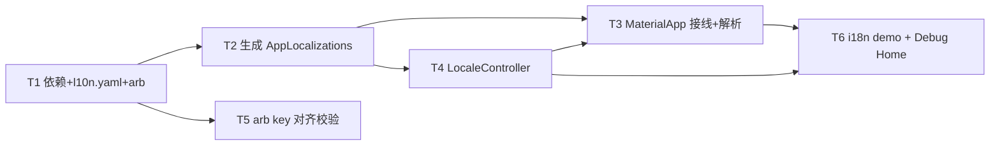

---
作者：@Ray
创建日期：2026-05-30
最后更新：2026-05-30
文档状态：已完成
---

# 任务列表：i18n-localization

## 任务依赖图
> 由各任务 inline「同 spec 依赖」字段汇总，以 inline 为准。



并行组：
- Group A：T1
- Group B：T2、T5（T5 只需 arb 就位，与生成并行）
- Group C：T4 →（T2+T4 齐）T3
- Group D：T6

（基础设施一体、无可独立部署/演示的中间切点 → 不设里程碑。）

-----

- [x] T1 · 引入依赖 + l10n.yaml + 中英 seed arb

**同 spec 依赖：** 无 ｜ **跨 spec 依赖：** 无 ｜ **关联需求：** R4 ｜ **依据设计：** D2, D3 ｜ **可改文件：** `pubspec.yaml`、`l10n.yaml`、`lib/l10n/arb/app_zh.arb`、`lib/l10n/arb/app_en.arb`

### 背景
搭 gen-l10n 的输入：依赖（`flutter_localizations` sdk + `intl` + `shared_preferences`）、配置（`l10n.yaml`）、中英双 arb（seed 文案 + 一条 plural 验证复数链路）。`pubspec.yaml` 已有字体/其他段，本任务只动 `dependencies` 与 `flutter:` 段的 `generate: true`，不碰既有声明。

### 实施
1. `pubspec.yaml` 的 `dependencies` 加 `flutter_localizations: { sdk: flutter }`、`intl`（版本随 SDK 约束解析）、`shared_preferences`；`flutter:` 段加 `generate: true`。
2. 仓库根建 `l10n.yaml`，内容按 design D2（`arb-dir`/`template-arb-file`/`output-dir: lib/l10n/gen`/`synthetic-package: false`/`nullable-getter: false`/`output-class: AppLocalizations`）。
3. 建 `lib/l10n/arb/app_zh.arb`：`@@locale: zh`，seed 文案（如 `appTitle`）+ 一条 ICU plural（如 `onThisDayCount(count)` → `{count, plural, =0{今天还没有记录} other{今天共 {count} 篇}}`），占位符配 `@key` 元数据。
4. 建 `lib/l10n/arb/app_en.arb`：`@@locale: en`，key 与 zh 完全一致，填英文（plural 按英文规则 `one/other`）。
5. `flutter pub get`（解析依赖；本任务不跑生成，生成归 T2）。

### 验收标准（做完即止）
- `flutter pub get` 成功解析依赖（含 `flutter_localizations`/`intl`/`shared_preferences`，缺/冲突则非零退出）（自动）。
- 两份 arb 均为合法 JSON 且 `@@locale` 正确、key 集合一致（自动，由 T5 的对齐校验覆盖；本任务先保证文件存在且 JSON 合法）。

### 验收方式
- 自动：
  ```bash
  flutter pub get \
    && test -f l10n.yaml \
    && python3 -c "import json;json.load(open('lib/l10n/arb/app_zh.arb'));json.load(open('lib/l10n/arb/app_en.arb'))"
  ```
  （`flutter pub get` 退出码断言依赖**可解析**；`json.load` 断言两份 arb 是合法 JSON——验文件可被工具消费，非 grep 文本。key 对齐的实质校验在 T5。）

### 验收记录
```
日期：2026-05-30
自动：PASS（flutter pub get 成功 + l10n.yaml 存在 + 两份 arb 合法 JSON）
人工：N/A
```

-----

- [x] T2 · 跑通生成，产出 AppLocalizations 并入库

**同 spec 依赖：** T1 ｜ **跨 spec 依赖：** 无 ｜ **关联需求：** R1 ｜ **依据设计：** D2 ｜ **可改文件：** `lib/l10n/gen/app_localizations.dart`（生成产物）、`lib/l10n/gen/app_localizations_zh.dart`（生成产物）、`lib/l10n/gen/app_localizations_en.dart`（生成产物）、`.gitignore`（仅当现有规则误伤 `lib/l10n/gen/` 时） ｜ **验收基建：** `test/l10n/app_localizations_test.dart`（import 生成产物的取值测试，预批）

### 背景
执行 gen-l10n，确认工具链可用、产物可复现、可编译、取值正确，并纳入版本库。`build_runner` 无关（gen-l10n 是独立子命令）。

### 实施
1. `flutter gen-l10n`（或 `flutter pub get` 触发 `generate: true`）；按 `flutter --version` 核实 `l10n.yaml` 配置项被接受（见 design 已知风险）。
2. 确认 `lib/l10n/gen/app_localizations.dart`（+ `_zh`/`_en`）生成，含 `AppLocalizations` 类与各 key 取值方法 + `plural` 方法。
3. 核对 `lib/l10n/gen/` 未被 `.gitignore` 忽略（`git check-ignore`）；若被误伤，在 `.gitignore` 加 `!lib/l10n/gen/` 例外。`git add` 生成产物入库。
4. 写 `test/l10n/app_localizations_test.dart`：分别用 zh/en `AppLocalizations`（经 `lookupAppLocalizations(Locale)` 或 pump 取），断言 `appTitle` 等 seed 取值与 arb 一致、`onThisDayCount(3)` 中英分别返回正确复数串。

### 验收标准（做完即止）
- `flutter gen-l10n` 成功产出 `lib/l10n/gen/app_localizations.dart`（exit 0，R1）（自动）。
- **生成产物可编译且取值正确**：`flutter test test/l10n/app_localizations_test.dart` 通过——import 生成的 `AppLocalizations`（缺类/不可编译则编译失败），断言 zh/en 下 seed 文案与 plural 取值正确（R1/R4；断言来源是产物**运行期取值**，独立于 arb/配置文本）（自动）。
- `lib/l10n/gen/` 已被 git 跟踪且未被 gitignore（R1 纳入版本库）（自动）。
- 重复执行生成幂等，无脏 diff（人工核查 @Ray，NF3）。

### 验收方式
- 自动：
  ```bash
  flutter gen-l10n \
    && test -f lib/l10n/gen/app_localizations.dart \
    && ! git check-ignore -q lib/l10n/gen/app_localizations.dart \
    && flutter test test/l10n/app_localizations_test.dart
  ```
  （`flutter test` 断言 `AppLocalizations` 在 zh/en 下的**取值**正确——把存在性检查升级为"import 产物 + 断言取值"的行为断言，验到 R1/R4；断言来源是产物运行期取值，非配置文件文本。）
- 人工（@Ray）：连续两次 `flutter gen-l10n` 后 `git diff lib/l10n/gen/` 无变化（幂等，NF3）。

### 验收记录
```
日期：2026-05-30
自动：PASS（gen-l10n 成功 + 产物存在 + 未被 gitignore + 15 个取值测试全过）
人工：PASS（连续两次 gen-l10n 后 git diff 为空，核查人 @Ray）
```

-----

- [x] T3 · MaterialApp 接线 + locale 解析（跟随系统 / 回退 zh）

**同 spec 依赖：** T2, T4 ｜ **跨 spec 依赖：** 无 ｜ **关联需求：** R2, R3 ｜ **依据设计：** D2, D4 ｜ **可改文件：** `lib/app.dart` ｜ **验收基建：** `test/l10n/material_app_locale_test.dart`（widget 测试，预批）

### 背景
把 `AppLocalizations.delegate` + 三个 Global 委托挂上 `MaterialApp`，`supportedLocales = [zh, en]`，`locale` 绑 `LocaleController`（T4），`localeResolutionCallback` 兜底回退 zh。职责边界：本任务只接线与解析；controller 本体归 T4。

### 实施
1. `MaterialApp.localizationsDelegates` = `[AppLocalizations.delegate, GlobalMaterialLocalizations.delegate, GlobalWidgetsLocalizations.delegate, GlobalCupertinoLocalizations.delegate]`。
2. `supportedLocales = AppLocalizations.supportedLocales`（zh, en）。
3. `locale = localeController.locale`（null=跟随系统）；`localeResolutionCallback`：入参 locale ∈ supported 用之，否则返回 `Locale('zh')`。
4. 根部提供/监听 `LocaleController`，切换即重建。

### 验收标准（做完即止）
- pump `MaterialApp`、deviceLocale=en → `AppLocalizations.of(context)` 返回英文 seed（自动，widget test，R3）。
- deviceLocale=zh → 返回中文 seed（自动，R3）。
- deviceLocale=fr（不支持）→ 回退中文 seed（自动，R3 回退）。

### 验收方式
- 自动：
  ```bash
  flutter test test/l10n/material_app_locale_test.dart
  ```
  （用 `tester.binding.platformDispatcher.localeTestValue` / `Localizations.override` 设不同系统 locale，pump 后 `find.text` 断言渲染出对应语言文案——验解析行为，不 grep 源码。）

### 验收记录
```
日期：2026-05-30
自动：PASS（en/zh/fr 三种 locale 的 widget 测试全过）
人工：N/A
```

-----

- [x] T4 · LocaleController（状态 + 持久化）

**同 spec 依赖：** T2 ｜ **跨 spec 依赖：** 无 ｜ **关联需求：** R5 ｜ **依据设计：** D4 ｜ **可改文件：** `lib/l10n/locale_controller.dart` ｜ **验收基建：** `test/l10n/locale_controller_test.dart`

### 背景
`LocaleController extends ChangeNotifier`，持 `Locale? override`（null=跟随系统），`init()` 读 `shared_preferences`、`setLocale(Locale)`/`followSystem()` 写持久化并通知。职责边界：只管状态与持久化，不挂 `MaterialApp`（挂载归 T3）。

### 实施
1. `LocaleController`：`Locale? get locale`；`init()`（读 `locale_override`：`zh`/`en`→对应 Locale，空/无→null）。
2. `setLocale(Locale)`/`followSystem()`：更新状态、写 `shared_preferences`、`notifyListeners()`。
3. 持久化读写异常时回落（override=null，跟随系统）、不抛。

### 验收标准（做完即止）
- `setLocale(en)` 后 `locale==Locale('en')` 且持久化写入（自动，mock prefs）。
- 有持久化值时 `init()` 优先采用（自动）。
- `followSystem()` 后 `locale==null`（跟随系统）且持久化清空（自动）。
- 持久化抛错时 `init()` 不崩溃、回落跟随系统（自动）。

### 验收方式
- 自动：
  ```bash
  flutter test test/l10n/locale_controller_test.dart
  ```
  （用内存 mock `SharedPreferences`（`setMockInitialValues`），断言状态转移、持久化读写与异常回落行为。）

### 验收记录
```
日期：2026-05-30
自动：PASS（7 个测试全过：状态转移 + 持久化读写 + 异常回落 + notifyListeners）
人工：N/A
```

-----

- [x] T5 · arb key 对齐校验（NF2）

**同 spec 依赖：** T1 ｜ **跨 spec 依赖：** 无 ｜ **关联需求：** NF2 ｜ **依据设计：** D5 ｜ **可改文件：** `scripts/check_arb_sync.sh` ｜ **验收基建：** `test/scripts/check_arb_sync_test.sh`（夹具构造一致/缺漏两种输入）

### 背景
把"两份 arb key 必须一致"做成可机检硬闸：比对 `app_zh.arb` 与 `app_en.arb` 的消息 key 集合（排除 `@@`/`@`元数据与占位符定义），一致 exit 0，缺漏/孤儿 exit 非零并列出差异。供日后 hook/CI 化。

### 实施
1. `scripts/check_arb_sync.sh`：解析两份 arb 的顶层消息 key（过滤 `@@locale`、`@`前缀元数据），求对称差，非空则非零退出并打印缺失/多余 key。
2. 退出码与文案稳定，供 CI/hook 调用。

### 验收标准（做完即止）
- 两份 key 一致 → exit 0（自动）。
- 人为造一份缺一个 key 的临时夹具 → exit 非零并指出该 key（自动，用临时夹具，不改真 arb）。

### 验收方式
- 自动：
  ```bash
  bash test/scripts/check_arb_sync_test.sh
  ```
  （夹具构造一致/缺漏两种输入，断言退出码与输出；**不** grep 脚本自身。）

### 验收记录
```
日期：2026-05-30
自动：PASS（4 个夹具测试全过：一致→exit0、en缺key→exit1、输出指明缺失key、zh缺key→exit1）
人工：N/A
```

-----

- [x] T6 · i18n demo + 挂 Debug Home

**同 spec 依赖：** T3, T4 ｜ **跨 spec 依赖：** 无 ｜ **关联需求：** R6 ｜ **依据设计：** D5 ｜ **可改文件：** `lib/demo/i18n_demo.dart`、`lib/demo/demo_entry.dart` ｜ **验收基建：** `test/demo/i18n_demo_test.dart`

### 背景
Debug Home 入口：一个 demo 页，含语言切换控件（跟随系统 / zh / en）与几条经 `AppLocalizations` 取用的文案（含 plural），真机可见"切语言文案随变"。作为横切契约（R6）的活样例。

### 实施
1. `i18n_demo.dart`：经 `LocaleController` 切语言，渲染 seed 文案 + plural（不同 count）+ 一个 `DateFormat` 日期，全部经 `AppLocalizations`/`intl`、屏内无裸字面量。
2. `demo_entry.dart` 的 `demos` 列表**末尾追加一行**（不插中间、不改 `DemoEntry` 字段）。

### 禁止
- 不改 `DemoEntry` 字段定义；不在 `demos` 中间插入；不动既有 demo。

### 验收标准（做完即止）
- `demos` 末尾新增项指向 `i18n_demo`，Debug Home 可进入（自动，widget test）。
- 切到 en 后 demo 文案变英文、切回 zh 变中文（自动，widget test：`find.text` 断言两语言取值，R6）。

### 验收方式
- 自动：
  ```bash
  flutter test test/demo/i18n_demo_test.dart
  ```
  （pump demo，经 controller 切 locale，`find.text` 断言文案随 locale 变——验行为，不 grep 源码。）

### 验收记录
```
日期：2026-05-30
自动：PASS（3 个 widget 测试全过：demos 含 i18n 入口 + zh 文案 + en 文案）
人工：N/A
```
