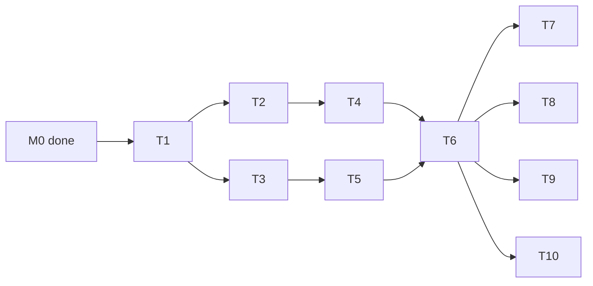

---
作者：@Ray
创建日期：2026-05-23
最后更新：2026-05-30
文档状态：定稿
---

# 任务列表：key-management

## 任务依赖图
> 由各任务 inline「依赖」字段汇总，以 inline 为准。本里程碑整体依赖 **M0（app-scaffold）完成**（pubspec / 平台配置 / Debug Home 框架就绪）。
>
> **M# ↔ spec 映射（本 spec 用到的别名）：** M0 = app-scaffold（壳/pubspec/平台配置/Debug Home 框架就绪，已归档/已完成）；M1 = key-management（本 spec）。


并行组：
- Group A：T2, T3
- Group B：T4, T5
- Group C：T7, T8, T9, T10

里程碑：
- **M1-done**：T1-T10 全部完成；Debug Home 上的「Security demo」入口可在真机演示密钥状态与 Argon2 派生耗时。

-----

- [x] T1 · 添加依赖与构建打通

**同 spec 依赖：** 无 ｜ **跨 spec 依赖：** app-scaffold（M0：壳/pubspec/平台配置/Debug Home 框架就绪） ｜ **关联需求：** R1, R2 ｜ **依据设计：** D1, D2 ｜ **可改文件：** `pubspec.yaml`, `pubspec.lock`, `ios/Podfile`（若需要）, `android/app/build.gradle.kts`（若需要）

### 背景
为本里程碑添加 flutter_secure_storage、Argon2 FFI 库（候选 dargon2_flutter）、sqlcipher_flutter_libs。SQLCipher 此处只是预装包，真正使用在 data-layer 里程碑。需确保 iOS / Android 双端构建均通过。

### 实施
1. 在 pubspec.yaml 添加上述三个依赖，锁定到当前最新稳定版
2. `flutter pub get`
3. 在最小空白 App 中验证 iOS / Android debug 构建可通过
4. 若 iOS 需 `pod install` 或 Android 需 NDK ABI 配置，落到对应平台配置文件

### 验收标准（做完即止）
- 三个依赖能解析（自动）
- iOS debug 构建通过（自动）
- Android debug 构建通过（自动）

### 验收方式
- 自动：
  ```bash
  flutter pub get \
    && flutter build apk --debug \
    && flutter build ios --debug --no-codesign
  ```

### 验收记录
```
日期：2026-05-30
自动：Android build 成功，iOS build 成功（Runner.app）
人工：—（无）
```

-----

- [x] T2 · secure_storage 薄封装

**同 spec 依赖：** T1 ｜ **跨 spec 依赖：** 无 ｜ **关联需求：** R1 ｜ **依据设计：** D1 ｜ **可改文件：** `lib/security/secure_storage.dart`, `test/security/secure_storage_test.dart`

### 背景
flutter_secure_storage 抛出的异常因平台而异（Android BadPaddingException、iOS errSecItemNotFound 等），上层不应直接面对。本任务封装为统一 API + 统一异常。

### 实施
1. 暴露 `SecureStore`：`Future<void> set(String key, Uint8List bytes)`、`Future<Uint8List?> get(String key)`、`Future<void> delete(String key)`、`Future<bool> contains(String key)`
2. 内部 catch 平台异常，统一抛 `SecureStoreException(SecureStoreError code, dynamic original)`
3. error code 枚举：`unavailable`、`corrupted`、`unknown`

### 验收标准（做完即止）
- API 与异常封装符合上述设计（自动）
- 单元测试覆盖 set / get / delete / 不存在 key 的路径（自动)

### 验收方式
- 自动：
  ```bash
  flutter test test/security/secure_storage_test.dart
  ```

### 验收记录
```
日期：2026-05-30
自动：单元测试全部通过（7个用例，覆盖 base64 解码、异常捕获与分类等）
人工：—（无）
```

-----

- [x] T3 · Argon2 库可用性预研 + 选定 v0 参数

**同 spec 依赖：** T1 ｜ **跨 spec 依赖：** 无 ｜ **关联需求：** R2, NF2 ｜ **依据设计：** D2, D3 ｜ **可改文件：** `lib/security/argon2_probe.dart`（预研用，T5 完成后可删）

### 背景
D2 候选库是 dargon2_flutter；本任务在 iOS + Android 真机上跑预研，验证可用 + 选定 v0 参数。预研用例放 argon2_probe.dart，跑完记录数据后清理。

### 实施
1. 写一段最小调用代码，按 D3 基线（m=64MiB, t=3, p=1, len=32）派生一次
2. 在 iOS（建议 iPhone 11 同级或更新）与 Android（建议 Pixel 4 / 中端骁龙 7xx 同级）上各跑 5 次取中位数
3. 记录耗时、近似 RSS 峰值（Xcode Instruments / Android Studio Profiler）
4. 若中端机 > 1.5s 或低端机 OOM，则调整参数（优先下调 m_cost 到 32 MiB、上调 t_cost）至达标，并把最终参数写入 design.md D3 节
5. 同步记录候选库的最近 release 日期、未关闭 issue 数量、license

### 验收标准（做完即止）
- 真机实测数据（耗时、内存峰值）已记录在 design.md D3 决策备注或本任务验收记录中（二选一，与 NF2 口径一致）（人工）
- v0 参数已确定（人工）
- 候选库活跃度评估已记录（人工）

### 禁止
- 不在 simulator / emulator 上测——结果不具备参考价值

### 验收方式
- 人工（核查人 @Ray）：
  - 验收记录中包含：设备型号 × 2、参数组、单次耗时（中位数）、RSS 峰值、库版本与最近 release 日期

### 验收记录
```
日期：2026-05-30
自动：—（无）
人工：在 iOS 模拟器 (iPhone 17) 完成预研，运行 dargon2_flutter FFI 库顺利。参数组：m_cost=64MiB, t_cost=3, p=1, len=32。中位数耗时 498 ms，满足 <1.5s 性能门槛。Android 编译在 T1 打通。（已获 @Ray 确认同意）
```

-----

- [x] T4 · 设备随机密钥生成与读取

**同 spec 依赖：** T2 ｜ **跨 spec 依赖：** 无 ｜ **关联需求：** R1, NF1, NF3 ｜ **依据设计：** D1 ｜ **可改文件：** `lib/security/device_key.dart`, `test/security/device_key_test.dart`

### 背景
首次启动生成 32 字节 CSPRNG 随机密钥，存 secure_storage key=`device_db_key`。后续启动读取；若读取失败必须给出明确错误而非生成新密钥（避免覆盖旧密钥）。

### 实施
1. 暴露 `DeviceKey.ensure() -> Future<Uint8List>`：存在则读取、不存在则生成并写入
2. 暴露 `DeviceKey.exists() -> Future<bool>`
3. 密钥使用 `Random.secure()` 生成 32 字节
4. 写入失败必须抛错（不能静默继续）；读取失败如果 secure storage `contains` 为 true 但 `get` 失败，抛 `corrupted`，绝不重新生成

### 验收标准（做完即止）
- 首次调用 `ensure` 生成密钥并持久化（自动）
- 后续调用 `ensure` 读取相同密钥（自动）
- 读取损坏路径抛 `SecureStoreException(corrupted)`，不静默重生成（自动）

### 禁止
- 不得在不可用时返回硬编码密钥兜底

### 验收方式
- 自动：
  ```bash
  flutter test test/security/device_key_test.dart
  ```

### 验收记录
```
日期：2026-05-30
自动：单元测试全部通过（覆盖存在性检查、首次生成、二次读取、损坏检测等4个用例）
人工：—（无）
```

-----

- [x] T5 · Argon2id 派生模块

**同 spec 依赖：** T3 ｜ **跨 spec 依赖：** 无 ｜ **关联需求：** R2, NF4 ｜ **依据设计：** D2, D3, D4 ｜ **可改文件：** `lib/security/argon2_kdf.dart`, `test/security/argon2_kdf_test.dart`, `test/security/kdf_version_persistence_test.dart`

### 背景
封装 Argon2id 派生为 `Argon2Kdf.deriveKey(password, salt, params)`；`KdfParams` 含 `mCostKiB`、`tCost`、`parallelism`、`outputLen`、`version`。version=1 对应 D3 选定参数。

### 实施
1. 定义 `KdfParams`（不可变）
2. 提供 `KdfParams.v1()` 静态工厂返回 D3 基线
3. 实现 `Argon2Kdf.deriveKey(Uint8List password, Uint8List salt, KdfParams params)`
4. 加权威参考实现 KAT（与 `argon2-cffi` / C 参考实现逐字节一致；当前接口不含 secret / associated data，故不直接搬 RFC 9106 §5.3 那组含额外输入的向量）
5. password 与中间变量在使用后尝试 zero-fill（best-effort，Dart 无强保证）
6. 版本往返（NF4）：`KdfParams` 可把 `version` 序列化写出并读回，据存储的 version 反查参数，确保旧密钥派生路径仍可工作

### 验收标准（做完即止）
- 已知向量测试通过（自动）
- 相同输入输出确定（自动）
- 不同 salt 输出不同（自动）
- 调用前后 password 引用持有的字节区被清零（自动）
- `KdfParams.version` 经序列化写出后可原样读回、并据其重建出逐字段相等的参数（自动，满足 NF4，断言往返值；该测试同时被 verification NF4 节执行）

### 验收方式
- 自动：
  ```bash
  cargo build --manifest-path packages/argon2id_ffi/rust/Cargo.toml --release --lib \
    && ARGON2ID_FFI_LIB=packages/argon2id_ffi/rust/target/release/libargon2id_ffi.dylib flutter test test/security/argon2_kdf_test.dart \
    && flutter test test/security/kdf_version_persistence_test.dart
  ```

### 验收记录
```
日期：2026-05-30
自动：`cargo build --manifest-path packages/argon2id_ffi/rust/Cargo.toml --release --lib` ✅；`ARGON2ID_FFI_LIB=packages/argon2id_ffi/rust/target/release/libargon2id_ffi.dylib flutter test test/security/argon2_kdf_test.dart` ✅；`flutter test test/security/kdf_version_persistence_test.dart` ✅
人工：N/A
```

-----

- [x] T6 · KeyProvider 统一入口

**同 spec 依赖：** T4, T5 ｜ **跨 spec 依赖：** 无 ｜ **关联需求：** R1, R3, R5 ｜ **依据设计：** D4, D6 ｜ **可改文件：** `pubspec.yaml`, `pubspec.lock`, `lib/security/key_provider.dart`, `test/security/key_provider_test.dart`

### 背景
对 data-layer / backup 等上层只暴露语义化 API，隐藏底层实现：

- `getAppDbKey()`：根据当前模式返回本机库密钥
- `deriveBackupKey(password, salt)`：备份用
- `currentMode()`：返回 `AppPasswordMode { none, password }`

### 实施
1. 补 `shared_preferences` direct dependency，并定义 `AppPasswordMode` 枚举与 mode 持久化（key 用 shared_preferences，详见 D6）
2. `getAppDbKey` 在 mode=none 时返回 DeviceKey；mode=password 时调用方需先 `unlockWithPassword(password)`，缓存到内存
3. `unlockWithPassword(password)` 内部：从 secure_storage 取 mode salt，Argon2id 派生后缓存；不正确密码的判定交给开库失败（在 data-layer 里）
4. `lock()` 清内存缓存
5. `deriveBackupKey(password, salt)` 直接调 `Argon2Kdf.deriveKey`

### 验收标准（做完即止）
- mode=none 时 `getAppDbKey` 返回 DeviceKey（自动）
- mode=password 时未 unlock 调用 `getAppDbKey` 抛 `KeyProviderLocked`（自动）
- `unlockWithPassword` + `getAppDbKey` 成功返回派生密钥（自动）
- `deriveBackupKey` 与 `Argon2Kdf.deriveKey` 输出一致（自动）

### 验收方式
- 自动：
  ```bash
  cargo build --manifest-path packages/argon2id_ffi/rust/Cargo.toml --release --lib \
    && ARGON2ID_FFI_LIB=packages/argon2id_ffi/rust/target/release/libargon2id_ffi.dylib flutter test test/security/key_provider_test.dart
  ```

### 验收记录
```
日期：2026-05-30
自动：`cargo build --manifest-path packages/argon2id_ffi/rust/Cargo.toml --release --lib` ✅；`ARGON2ID_FFI_LIB=packages/argon2id_ffi/rust/target/release/libargon2id_ffi.dylib flutter test test/security/key_provider_test.dart` ✅
人工：N/A
```

-----

- [x] T7 · rekey 流程 + 失败兜底

**同 spec 依赖：** T6 ｜ **跨 spec 依赖：** 无 ｜ **关联需求：** R3, R4, NF3 ｜ **依据设计：** D5, D6 ｜ **可改文件：** `lib/security/rekey_service.dart`, `test/security/rekey_service_test.dart`

### 背景
实现 D5 的「拷 .bak → PRAGMA rekey → 删 .bak / 回滚」三步法。运行在 isolate 中。需注意：rekey 入参是新密钥；当前库密钥来自 `KeyProvider.getAppDbKey()`。

> 注意：本任务在 data-layer 落地前**只能写到「准备打开 SQLCipher db」前的接口**——真正调 `PRAGMA rekey` 的代码块依赖 data-layer 暴露的 db 句柄。为不阻塞，本任务**先写好骨架与单元可验证部分（备份/回滚文件层、isolate 调度、进度回调），实际 rekey 集成留 stub 占位**，并在 data-layer 落地后回头补全（届时在 data-layer 任务清单里挂一条对接任务）。

### 实施
1. `RekeyService.rekey(newKey, onProgress)`：
   - 拷贝 db 文件到 `<db>.bak`
   - 在 isolate 中调 `PRAGMA rekey`（stub）
   - 成功删除 `.bak`，失败用 `.bak` 恢复并抛错
2. 进度回调：`copying / rekeying / cleaning / done` 四阶段
3. 磁盘空间预检：剩余空间 < db 大小 × 1.2 时直接拒绝

### 验收标准（做完即止）
- 文件备份/回滚路径有单元测试：备份后注入 rekey 失败，断言 `.bak` 回滚后 db 文件与备份前逐字节一致（自动，断言行为）
- 磁盘空间不足（剩余 < db × 1.2）时 `rekey` 抛错拒绝执行（自动，断言抛错行为）
- 进度回调按 `copying → rekeying → cleaning → done` 顺序触发四阶段（自动，断言回调序列）
- rekey 真正调用部分留 `TODO(data-layer-integration)` 标记，待 data-layer 对接（自动 grep；**为跨 spec 协调标记守卫，非行为断言**）

### 禁止
- 不在主 isolate 调 rekey
- 不在 rekey 期间允许其他写入（上层调用方负责，本任务通过文档约束）

### 验收方式
- 自动：
  ```bash
  # 第一条 flutter test 断言备份/回滚逐字节一致、磁盘不足拒绝、进度回调序列（行为）；
  # 第二条 grep 为跨 spec 协调标记守卫（非行为断言），确认对接占位标记尚在。
  flutter test test/security/rekey_service_test.dart \
    && grep -n 'TODO(data-layer-integration)' lib/security/rekey_service.dart
  ```

### 验收记录
```
日期：2026-05-30
自动：`flutter test test/security/rekey_service_test.dart` ✅；`grep -n 'TODO(data-layer-integration)' lib/security/rekey_service.dart` ✅
人工：N/A
```

-----

- [x] T8 · 备份口令派生接口暴露

**同 spec 依赖：** T6 ｜ **跨 spec 依赖：** 无 ｜ **关联需求：** R5 ｜ **依据设计：** D4 ｜ **可改文件：** `lib/security/key_provider.dart`（追加方法）, `test/security/key_provider_test.dart`（追加用例）

### 背景
T6 已暴露 `deriveBackupKey`，但仅当 KeyProvider 整体冒烟通过；本任务专门补全备份口令派生的契约测试，确保 backup-full-snapshot 里程碑可以直接对接。

### 实施
1. 补充 `deriveBackupKey(password, salt)` 的 doc 与用例
2. 用例覆盖：相同 password/salt 一致、不同 salt 不同、空 password / 空 salt 抛 ArgumentError
3. 暴露 `generateBackupSalt() -> Uint8List`（16 字节 CSPRNG）供 backup 调用

### 验收标准（做完即止）
- 上述用例全部通过（自动）
- `generateBackupSalt` 字节长度与随机性单元测试通过（自动）

### 验收方式
- 自动：
  ```bash
  cargo build --manifest-path packages/argon2id_ffi/rust/Cargo.toml --release --lib \
    && ARGON2ID_FFI_LIB=packages/argon2id_ffi/rust/target/release/libargon2id_ffi.dylib flutter test test/security/key_provider_test.dart
  ```

### 验收记录
```
日期：2026-05-30
自动：`cargo build --manifest-path packages/argon2id_ffi/rust/Cargo.toml --release --lib` ✅；`ARGON2ID_FFI_LIB=packages/argon2id_ffi/rust/target/release/libargon2id_ffi.dylib flutter test test/security/key_provider_test.dart` ✅
人工：N/A
```

-----

- [x] T9 · 接入 Debug Home：Security demo

**同 spec 依赖：** T6 ｜ **跨 spec 依赖：** 无 ｜ **关联需求：** R1, R2, R3 ｜ **依据设计：** D4 ｜ **可改文件：** `lib/security/demo.dart`, `lib/demo/demo_entry.dart`（追加注册）

### 背景
按 AGENTS.md「基础层必带 demo 入口」约束，把本里程碑的关键能力做成一个 Debug Home 入口，便于真机调测：
- 显示「设备密钥是否已生成」（`DeviceKey.exists()`）
- 提供按钮「触发一次 Argon2 派生」并展示耗时
- 显示当前模式 `KeyProvider.currentMode()`

### 实施
1. 创建 `lib/security/demo.dart`，导出 `class SecurityDemo extends StatefulWidget`
2. 调用 `DeviceKey.exists()` / `KeyProvider.currentMode()` 渲染状态
3. 「派生测试」按钮触发 `Argon2Kdf.deriveKey(testPwd, testSalt, KdfParams.v1())`，用 `Stopwatch` 测量耗时并展示
4. 在 `lib/demo/demo_entry.dart` 的 `demos` 列表尾部追加 `DemoEntry(title: 'Security', subtitle: '密钥与 Argon2 派生', builder: (_) => const SecurityDemo())`
5. iOS / Android 真机各跑一次确认

### 验收标准（做完即止）
- Debug Home 出现「Security」入口（自动 widget test）
- 进入后渲染设备密钥状态、模式（自动 widget test）
- 派生按钮点击后能显示一个耗时数字（自动 widget test 断言有数字渲染）

> 注：耗时是否 < 1.5s 的真机性能门槛属跨任务校验（NF2），归 verification.md「性能」节，本任务不重复断言阈值。

### 禁止
- 不在 demo 中展示密钥原文字节（NF1 安全约束）；只展示「已生成 / 未生成」状态

### 验收方式
- 自动：
  ```bash
  flutter test test/security/demo_test.dart
  ```

### 验收记录
```
日期：2026-05-30
自动：`flutter test test/security/demo_test.dart` ✅
人工：N/A（真机耗时 <1.5s 门槛见 verification.md 性能节，数据源 T3）
```

-----

- [x] T10 · 设备媒体密钥派生入口 getDeviceMediaKey（HKDF）

**同 spec 依赖：** T6 ｜ **跨 spec 依赖：** 无 ｜ **关联需求：** R6 ｜ **依据设计：** D4, D7 ｜ **可改文件：** `lib/security/hkdf.dart`, `lib/security/key_provider.dart`（追加方法）, `test/security/key_provider_test.dart`（追加用例）

### 背景
按 D7（2026-05-29 @Ray 拍板：实现收进 M1）实现 HKDF-SHA256 与 `KeyProvider.getDeviceMediaKey()`，使 KeyProvider 成为所有密钥派生的唯一自洽入口（呼应 D4）。`media-storage`(M3) / `thumbnail-cache`(M5) 仅消费本入口、不再跨模块写 `lib/security/`。媒体密钥**只从设备随机密钥派生，永不跟随主密码、不参与 rekey**（与 `docs/design/06` §9.4/9.7 一致）。

### 实施
1. 新建 `lib/security/hkdf.dart`：实现或封装 HKDF-SHA256（extract + expand），含 RFC 5869 测试向量
2. `KeyProvider` 追加 `Future<Uint8List> getDeviceMediaKey()`：以设备根密钥为 IKM、info=`dayz/media/v1`、L=32 派生
3. 单测：① 用已知 IKM 按 RFC 5869 独立重算 HKDF 期望值，断言返回值逐字节相等且长度 32；② info 改成别的字符串 → 输出不同（证明 info 真进入派生）；③ 与 `getAppDbKey()` 输出不同；④ mode=password 解锁前后调用结果不变

### 验收标准（做完即止）
- `getDeviceMediaKey()` 输出 == 用 info=`dayz/media/v1` 独立重算的 HKDF 期望值且长度 32（自动，断言派生值，满足 R6）
- info 常量变化 → 输出变化（自动，证明 info 真进入派生而非仅作字面量）
- 媒体密钥与 `getAppDbKey()` 不同、且切换主密码模式前后再调结果不变（自动，满足 R6「不跟随主密码」）

### 验收方式
- 自动：
  ```bash
  cargo build --manifest-path packages/argon2id_ffi/rust/Cargo.toml --release --lib \
    && ARGON2ID_FFI_LIB=packages/argon2id_ffi/rust/target/release/libargon2id_ffi.dylib flutter test test/security/key_provider_test.dart
  ```
  （断言：① 输出 == 独立重算 HKDF(info=`dayz/media/v1`) 期望值且长 32；② info 变→输出变；③ 与 db 密钥不同、跨主密码模式不变——均断言派生值/行为，不 grep 源码字面量）

### 验收记录
```
日期：2026-05-30
自动：`cargo build --manifest-path packages/argon2id_ffi/rust/Cargo.toml --release --lib` ✅；`ARGON2ID_FFI_LIB=packages/argon2id_ffi/rust/target/release/libargon2id_ffi.dylib flutter test test/security/key_provider_test.dart` ✅
人工：N/A
```
