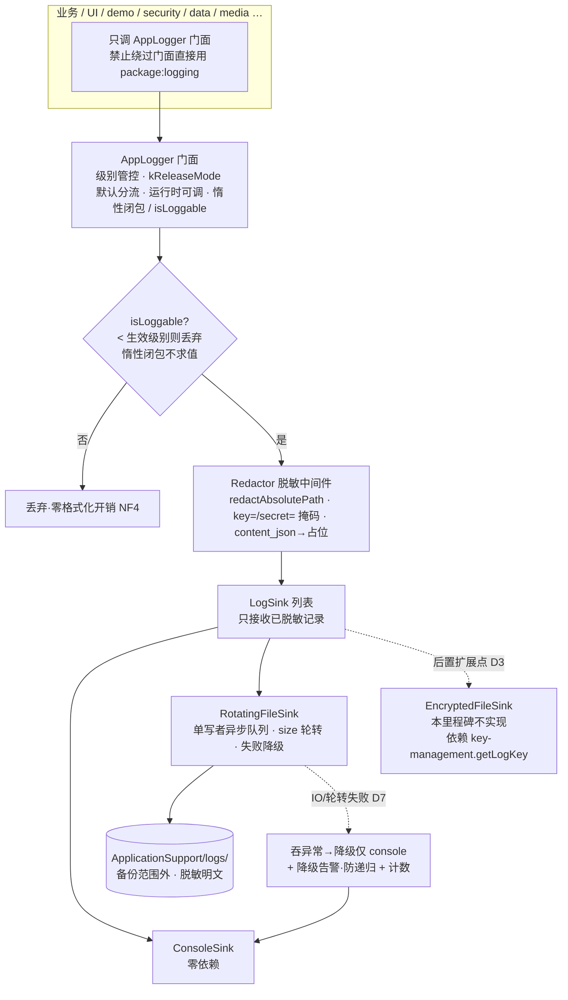

---
作者：@Ray
创建日期：2026-05-30
最后更新：2026-05-30
文档状态：已定稿
---

# 设计：observability（可观测性 · 日志基建）

> 本设计是「3 架构师竞争提案 → 综合器批判合并 + @Ray 4 项产品拍板」的产物。最核心取舍是 D3（落盘静止态保护）：在「先上零依赖底座 / 调试可读 / 不阻塞 P0」与「静止态加密纵深防御」之间，选脱敏明文底座 + 加密后置可插拔扩展点。

## 技术决策

### D1 · 日志库选型：dart.dev `logging` 薄内核 + 自建 `AppLogger` 门面
- **状态：** 采纳
- **背景：** 需要分级、可定向输出、可脱敏的日志能力。生态候选：`logging`（dart.dev 官方、零传递依赖、不替你做输出）、`logger`（彩色 PrettyPrinter，但默认 `print` 输出、release 需自裁）、`talker`（全家桶 + in-app 查看器，偏重且查看器=日志持久展示）。
- **选项：** 直接用 `logger` 默认行为 / 直接用 `talker` 全家桶 / `logging` 薄内核 + 自建门面集中管控
- **选择：** `logging` 薄内核 + 自建 `AppLogger` 门面。门面是级别 / 脱敏 / 输出目标的唯一信任根。
- **理由：** 隐私优先 App 的日志，最大风险不是"不够好用"而是"把敏感数据写进会落盘的日志"。`logging` 零依赖、不替你输出 → 脱敏 / 落盘 / 级别全握在自己手里；`logger` 的默认 `print` 输出、`talker` 的持久查看器都是隐私雷区，不该当地基。符合"第三方包优先选活跃维护 + 最小依赖"（`logging` 由 dart.dev 维护、活跃）。
- **代价：** 控制台美化、文件输出要自己写门面层。可接受——这正是把管控权收归己方所必需的。须警惕 `logging` 的全局 `Logger.root` 单例：门面是唯一真源，业务层 MUST NOT 绕过门面直接用 `Logger.root` 注入未脱敏 record（见 D4 守卫）。

### D2 · 机械可验的脱敏机制（四层叠加，信任根集中在门面）
- **状态：** 采纳
- **背景：** 对 LLM / 未来贡献者，"请别打敏感数据"的荣誉制不成立，凡能机械校验的必须做成硬闸。要保证密钥字节 / 日记正文 / 绝对路径绝不进日志。
- **选项：** 纯文档约定 + 人审（荣誉制，否决）/ 仅出站正则黑名单（单点，误杀漏杀）/ 类型化 API + 路径脱敏纯函数 + 全 lib 缺失守卫 / 上述 + 不可关闭的门面中间件兜底
- **选择：** 四层叠加：① **结构层**——`AppLogger` 只暴露 `log(level, event, {fields})` 与惰性 `logFine(() => ...)`，`fields` value 只接受脱敏后安全标量（int / enum / 相对路径 / hash），门面 MUST NOT 暴露 `log(Object)`（防 `logging` 包 `toString` 绕过类型脱敏）；② **中间件层**——所有 record 落任一 sink 前统一过 `Redactor`（门面强制，各 sink 收到的都是已脱敏记录），**对 message 与 fields 分别定义作用域**：
  - **message（自由文本 `String?`）**：做正则脱敏——绝对路径前缀 → 相对 / `<app-private>` 占位（经 `redactAbsolutePath`）；命中**值位**敏感模式（紧邻 `=`/`:` 的 `key=`/`password=`/`secret=`/`token=` 右侧值）→ `***`。
  - **fields（结构化 `Map<String,Object?>`）**：按 **key 名**匹配敏感键（`key`/`password`/`secret`/`token`/`derived` 等）→ value 置 `***`；按 **字段名**识别 `content_json` / `content_plain` → 替换为 `<redacted:len=N>`（不落正文）；其余 value 经 `redactAbsolutePath` 扫绝对路径。
  - 即：message 走正则 + 路径脱敏，fields 走 key 名 / 字段名匹配——两条路径在 T3 各有断言（见 tasks T3）；③ **工具层**——`redactAbsolutePath(String)` 纯函数作为绝对路径脱敏的**推荐真源**（供 `media-storage` 等复用；是否接入由对侧 spec 决定，接入前不断言两处不漂移，见已知风险）；④ **守卫层（best-effort 粗筛，非主闸）**——把 `key-management/verification.md` 既有仅覆盖 `lib/security` 的 grep 缺失守卫思路扩成覆盖全 `lib/` 的 tripwire（排除脱敏真源文件自身）。**明确**：grep 无法平衡括号（惰性闭包 `logFine(() => ...)` 体内拼接为已知漏报）、子串匹配可能误伤合法标识符，故该 grep 是**辅助 tripwire、命中需人工判定**；NF1 的真红线断言压在 ③ 的 `redactAbsolutePath` 单测（验值）与 Redactor / 落盘端到端行为测（验落盘字节）上，不靠 grep 兜底（见 verification 安全专项与 D2 代价）。
- **理由：** 脱敏放门面 = 信任根集中（一处正确处处正确），优于指望每调用点自觉、也优于各 sink 重复实现。类型化 API 从入口堵掉"顺手把 key 字节 / 正文对象塞进 message"。抗规避：`redactAbsolutePath` / `Redactor` 走真实输入→输出值断言（验值不验源码字面量）；grep 守卫断"缺失"（命中即 fail，扫 `lib/` 业务代码而非 observability 被改文件自身）。
- **代价：** 类型化 API 牺牲随手 `log(任意字符串)` 的便利；门面 + Redactor 不能 100% 防对抗式滥用（密钥拼进自由文本且不带可识别模式），只能 best-effort + 类型化收窄 + 守卫兜底；全 lib grep 须精确限定"日志调用 + 敏感词在实参位"，否则误伤合法标识符。requirement NF1 已声明不向用户 / 审计承诺绝对脱敏。

### D3 · 落盘文件的静止态保护：脱敏明文落盘为底座，加密 sink 为后置可插拔扩展点
- **状态：** 采纳（@Ray 2026-05-30 拍板）
- **背景：** 用户硬需求是"日志必须支持落盘"。db 始终 SQLCipher、媒体始终设备密钥加密——日志该不该也是密文？这是三份提案的根本分歧点。
- **选项：** A 仅脱敏明文落盘（零 `key-management` 依赖、调试直接读）/ B 设备 key 经 HKDF(info=`dayz/log/v1`) 派生 log key、AES-256-GCM 加密落盘 / C 分层：脱敏明文落盘为零依赖底座（本 spec 真落盘）+ 加密 `FileSink` 为后置可插拔扩展点
- **选择：** **C（分层）**。本 spec 交付 = 脱敏明文落盘 + size 轮转 + 应用私有诊断目录 + 不进备份；`LogSink` 抽象接口本 spec 定义并预留加密扩展点；`EncryptedFileSink` 实现 + 其所需 `getLogKey()` 入口归后续衍生 spec，本里程碑不实现、不进可改文件上界。
- **理由：** ① **读源**——用户说"支持落盘"未说"必须加密落盘"，读成必须加密会让横切诊断底座阻塞在 P0 的 `key-management` 之后，与"`auto-save` R5 / `media` NF5 已在等记日志能力、底座应先就绪"冲突；② **读红线**——`key-management` D7（2026-05-29 @Ray 拍板）规定 `key-management` 独占 `lib/security/{hkdf,key_provider}.dart` 写权、消费方只调接口，故加密所需 `getLogKey()` 必须归 `key-management` 出，observability 不得越界改 `lib/security`；③ **读敏感度**——日志已被 D2 四层脱敏（无密钥 / 正文 / 绝对路径）+ 应用私有沙箱 + 不进备份（不外流），敏感度远低于始终加密的 db / media 本体，剩余暴露面是"丢机取证 × 脱敏漏网"的二阶概率，用多层脱敏压低即可；④ 明文调试可直接读、无需解密工具，排障摩擦最低；⑤ 加密做成 `LogSink` 扩展点而非内核，对 KeyProvider / HKDF 的耦合关进可插拔实现，内核不感知。**同时不把加密贬为可有可无**：隐私优先 App 保留静止态加密升级开口，故落为"已定义 `LogSink` 抽象 + 本决策明确升级路径 + `getLogKey` 归属裁定"。
- **升级路径（可逆性高）：** 升级到加密落盘 = 新增 `EncryptedFileSink implements LogSink` + 在门面 sink 注册处替换 / 追加，内核（门面 / 级别 / 脱敏 / 轮转契约）零改动、现有明文 sink 测试不受影响。前置已就位：`key-management` 已有 HKDF-SHA256 + KeyProvider 模式（D7 `getDeviceMediaKey` 是现成先例），加 `getLogKey(info="dayz/log/v1")` 只是同模式再派生一把、归 `key-management` 一个新 task，无新密码学决策。
- **代价：** 放弃"脱敏漏网仍有密文兜底"的静止态纵深防御——若 D2 脱敏遗漏，明文日志留可读残留（仍在沙箱内、不进备份）。唯一不可逆历史包袱：升级前已落盘的明文不会追溯加密（但受 NF2 轮转上限 ~3 MiB、size 轮转会很快滚掉旧明文）。明确取舍，靠 NF1 四层脱敏 + release 默认 INFO 压低暴露面。

### D4 · 模块分层与依赖方向：observability 为零依赖横切底座（新增第八模块层）
- **状态：** 采纳
- **背景：** observability 应像 `security` 一样是底座，但比 security 更横切（连 security / data / media 自己都要记日志）。它该放分层的哪一层、依赖谁？
- **选项：** 单层（直接依赖 `key-management`，加密 sink 内置，强耦合阻塞早期模块）/ 完全零依赖（加密由各调用方自理，散落实现）/ 分两层（零依赖底座本 spec 交付 + 依赖 `key-management` 的加密 sink 后置经 `LogSink` 接口插入）
- **选择：** **分两层**。本 spec 只交付"零依赖横切底座"。依赖方向硬约束：
  - 业务 / UI / demo / security / data / media … → **只调 `AppLogger` 门面**（只认 `AppLogger` + `LogSink` 抽象），MUST NOT 绕过门面直接 import `package:logging` 注入未脱敏 record；
  - `AppLogger` 门面 → 薄内核 `logging` + `Redactor` + `LogSink` 列表；
  - `LogSink` 抽象 ← `ConsoleSink`（零依赖）/ `RotatingFileSink`（脱敏明文，依赖 `dart:io` + `path_provider`，`path_provider` 已在 pubspec）；
  - `lib/observability/` 全模块 MUST NOT import `lib/security` / `lib/data` / `lib/media` / `drift`。
  - barrel `observability.dart` 对外只暴露 `AppLogger` 门面 + `LogLevel`，`Redactor` / `RotatingFileSink` 等为模块内实现细节（类比 `data-layer` 的 Repo 边界硬、DAO 内部）。
- **理由：** 零依赖让 observability 与 `key-management`(P0) 并行、甚至先于 `data-layer` 就绪，不进数据 / 加密串行主干链。门面只认 `LogSink` 接口 → 加密 sink 是"插件"不是"地基"。
- **代价：** `LogSink` 抽象多一层间接（横切底座本应有，成本可忽略）。**`lib/observability/` 是七个既有模块（backup/data/drafts/media/security/thumbnails/ui）之外的第八个模块目录**——按 `CLAUDE.md`「维护本文件」节，引入新模块层属结构性约定，故 T1 MUST 在同一 commit 一并更新 `CLAUDE.md` 架构大图（已列入 T1 可改文件与本设计 `## 文件变更`）。

### D5 · release/debug 默认级别 + 热路径零格式化开销
- **状态：** 采纳（@Ray 拍板 release = INFO）
- **背景：** release 包若仍执行 fine 日志的字符串拼接 / 序列化即纯浪费且扩大暴露面；但又要保留真机现场提级排障的能力。
- **选项：** release/debug 同级别（性能 / 隐私双输）/ `kReleaseMode` 分流 + 惰性闭包 + `isLoggable` 守卫 + 运行时可调 / `kReleaseMode` 编译期裁剪所有 fine（彻底但不可运行时调）
- **选择：** 按 `kReleaseMode` 分流默认级别（release = INFO 含 WARNING/SEVERE 落盘，debug = FINE）+ 运行时可调。门面提供 `isLoggable(Level)` 守卫与惰性闭包 `logFine(() => '...')`；热路径 MUST 用闭包形态或先 `isLoggable` 守卫，级别不满足时不构造字符串、不格式化、不脱敏。运行时 `setLevel` 供 Debug Home 临时提级。
- **理由：** `logging` 包原生支持 `Level` / `Logger.level`，但预拼字符串即便被级别过滤也已付出格式化代价 → 热路径必须惰性闭包（标准解法）。release 默认 INFO 兼顾事后基本可诊断与精简。
- **代价：** 惰性闭包比直接传字符串略繁琐，需 design / review 引导热路径使用（NF4 行为测断言被过滤级别不触发 builder）；运行时可调意味 release 理论上能被调到 fine——但仍受 D2 脱敏约束，不泄露敏感数据。

### D6 · 落盘轮转：size-based + 份数 + 总量硬上限
- **状态：** 采纳（@Ray 拍板基线 1 MiB × 3 ≈ 3 MiB）
- **背景：** 移动端磁盘宝贵、不该占用户媒体空间，日志必须有硬上限防无限增长。
- **选项：** 单文件无限追加（禁止）/ size-based（单文件大小 + 保留份数）/ time-based（受设备时钟影响）/ size + 份数 + 总量硬上限兜底
- **选择：** size-based 三控：单文件达软上限（1 MiB）即 rotate 为 `app.log.1..app.log.N`（N=3），超出最旧删除，并设总占用硬上限（≈ 3 MiB）兜底。阈值 / 份数 / 总量集中为一处常量。
- **理由：** size-based 上界可证（份数 × 单文件 = 确定总量），不依赖系统时钟。日记 App 日志量低，足够覆盖近期排障窗口。可单测断言"写超阈值后文件数 ≤ 份数、总量 ≤ 硬上限、最旧已删"。
- **代价：** 不保证按时间均匀保留，高频日志日可能挤掉昨天记录（排障关心最近窗口，可接受）；轮转在写路径上须轻量（rename + 偶发 unlink，非每写都扫描），并发写须串行化避免轮转竞态（见 D9 单写者队列）。

### D7 · 落盘失败降级 + 不进 DB 事务
- **状态：** 采纳
- **背景：** 诊断设施第一铁律：观测不能反噬被观测系统。
- **选项：** 失败抛异常上抛（污染业务，禁止）/ 吞异常 + 降级 console + 降级告警 + 计数（绝不影响业务、绝不进 DB 事务）/ 失败缓冲重试 / 阻塞（磁盘满雪崩，禁止）
- **选择：** file sink 任何 IO / 轮转失败 MUST 内部捕获吞掉、降级为仅 console、向 console 发一条"file sink 降级，原因 X"告警（该告警 MUST NOT 再触发落盘，防递归）+ 内部计一次降级状态供 Debug Home 查看，绝不向调用方抛出。`AppLogger` 任一调用 MUST NOT throw。日志写入是纯文件 IO，MUST NOT 出现在任何 Drift / SQLCipher 事务边界内（咬合 `docs/design/09`）。
- **理由：** `auto-save` R5 记保存失败日志时，日志本身再失败不能二次打断书写。吞异常 + 降级 console 保证最坏仍有输出；降级告警让降级本身可见。日志不进 DB 事务避免把文件 IO 不确定性带进事务边界，正是 09 要防的伪原子性。
- **代价：** 吞异常意味落盘静默失败时调用方无显式感知，只能在 Debug Home 看降级计数 / console 告警；递归防护（降级告警不得再落盘）须小心实现。

### D8 · 日志不进备份（诊断派生数据）
- **状态：** 采纳
- **背景：** 日志含设备运行细节 / 行为线索，跨设备恢复无价值，打进可上云备份会放大脱敏遗漏风险并增体积。
- **选项：** 日志打进备份（隐私 + 体积，禁止）/ MUST NOT 进备份、目录置于备份扫描范围外、暴露日志根目录常量供 backup 排除 / 用户可选（增复杂度无必要）
- **选择：** 日志文件 MUST NOT 被打进备份包。日志落盘目录定在 `getApplicationSupportDirectory()` 下 `logs/`（与 db / media 备份收录根物理隔离、天然在备份扫描范围之外）。本 spec 暴露日志根目录常量供 `backup-full-snapshot` 排除；真正的"备份包不含日志"拦截 / 断言归 `backup-full-snapshot` 的 verification（跨 spec 协调点），本 spec 侧只断言"日志根目录解析自 ApplicationSupport 且与备份收录根前缀不重叠"。
- **理由：** 有冻结决策背书——`docs/design/06` §9.4 明确缩略图 / FTS 等可重建派生数据不进备份，日志同类。目录物理隔离让备份天然扫不到（防御性）。
- **代价：** 换机后无历史日志（本机即时排障用，跨机价值低，可接受）；需 `backup-full-snapshot` 配合在收录白名单排除 `logs/`——本 spec 无法单方面闭环，只能声明约束 + 暴露常量 + 本侧目录隔离断言占位。

### D9 · 落盘 / 轮转不单开 isolate：主隔离异步单写者队列
- **状态：** 采纳
- **背景：** `CLAUDE.md`「重活进 isolate」原则——但"重" = 会卡 UI 的 CPU 密集活。日志该不该进 isolate？
- **选项：** 所有写入进专用 isolate（套用字面原则，但日志本应轻量、跨 isolate 每条序列化成本高）/ 主隔离异步 buffered append + 单写者串行队列、轮转也在主隔离 / 仅轮转进 isolate
- **选择：** 不为日志单开 isolate。写入走主隔离的异步 buffered append（**单写者串行队列**，避免每条 flush 且解决并发写与轮转竞态）；size 轮转的 rename / 删旧也在主隔离做（份数 ≤ 3、单次 rename 是轻量元数据操作）。队列参数钉死（常量并入 `log_rotation.dart`）：**有界队列容量基线 = 4096 条**；**溢出丢弃最旧**并计一次降级告警（与 D7 降级计数同源）；sink 暴露 `flush()` / `close()` Future（见 API 契约），供测试 await 异步落盘完成，消除 T7「写后未落地即读」竞态。
- **理由：** 逐条 append 是低频小数据 IO，不属"会卡 UI 的 CPU 密集活"；进 isolate 反而引入跨隔离每条序列化的固定成本。单写者队列顺带集中处理并发写、轮转竞态与降级。本 spec 不涉加密（后置），无加密 CPU 活的 isolate 考量。
- **代价：** 极端高频日志（滚动每帧 fine）理论上队列积压——已被 D5 release 默认 INFO + 热路径惰性从源头限流；有界队列（4096 条）溢出丢弃最旧（属降级，计数告警）兜底。未来 `EncryptedFileSink`（后置）若实测加密致主隔离抖动，届时该实现自行评估是否进 isolate，不影响本底座。

### D10 · 门面初始化时序、未就绪行为与生产接线归属
- **状态：** 采纳
- **背景：** R1 把"AppLogger 已初始化"当前提，但谁初始化门面、`RotatingFileSink` 依赖的 `getApplicationSupportDirectory()` 是异步（file sink 必为异步 attach）、attach 前 / 未初始化即记日志会怎样、生产 App 在哪接线，均需钉死——否则下游 import 门面后撞"门面在、却没人装 file sink"的缺口。
- **选项：** 强制显式 init 后才能用（未 init 记日志即抛，违反 R4 不抛）/ 零配置默认可用（ConsoleSink 恒在、file sink 异步 attach、attach 前只走 console 不丢）/ 同步阻塞解析目录后才可用（卡启动）
- **选择：** 门面**零配置默认即可用**——构造即挂 `ConsoleSink`，任何时刻记日志至少走 console、**永不抛、永不丢**；`RotatingFileSink` 经一次异步 `attachFileSink()`（解析 ApplicationSupport 后）注册，**attach 完成前的日志只走 console**（不缓冲落盘、不丢、不阻塞调用方）。未初始化 / attach 中调用 `log` 的行为确定：仅 console、不抛（与 R4 / NF3 咬合）。
- **理由：** 零配置可用让 `auto-save-draft` / `media-storage` 等下游 import 即用、不被初始化时序绊住；ConsoleSink 恒在保证最坏可诊断。
- **代价：** **生产 main.dart 何时调 `attachFileSink()` 属范围外**（见 requirement 范围外）——本里程碑只在 Debug Home（T8）装配 file sink，下游 import 门面即得 console 日志，真正落盘须由后续"生产接线 spec"显式 attach。已显式划出范围，不留隐含缺口；attach 前启动早期日志只 console（量小，可接受）。

## 架构

依赖方向：`observability` 仅依赖 `dart:io` / `package:logging` / `path_provider`，被所有业务模块依赖、不依赖任何业务模块。

## 门面对外 API 契约（伪签名 · 钉死 T2/T4/T5/T7 共用约定）

> 以下伪签名是 T2（LogLevel/LogRecord/LogSink）、T4（AppLogger 门面）、T5/T7（sink 行格式）共用的契约，实现者据此落地、不得各自臆测。Dart 伪代码，最终公开签名以此为准。

- **级别**：`enum LogLevel { fine, info, warning, severe }`，有序（fine < info < warning < severe）。纯函数 `LogLevel defaultLevelFor(bool releaseMode)`：`true → info`、`false → fine`（可测，对应 D5）。
- **event 码**：自由 `String`，约定为稳定简短事件标识（dot/kebab 命名，如 `'autosave.retry-exhausted'`），**非受控枚举**（避免跨模块来改本 spec 的枚举）；event 视为非敏感、不经脱敏，调用方 MUST NOT 把敏感数据塞进 event。
- **门面方法**（`AppLogger` 单例 + 可注入构造便于测试）：
  - 直接形态：`void log(LogLevel level, String event, {Map<String, Object?> fields})`
  - 分级糖：`logFine / logInfo / logWarning / logSevere`，**每个都有惰性重载** `void logFine(String Function() messageBuilder, {Map<String, Object?> fields})`——`messageBuilder` 返回给人读的 message 文本，仅在 `isLoggable` 通过时才调用；`fields` 直接传入（不惰性，应为轻量已脱敏标量）。
  - `bool isLoggable(LogLevel level)`；`void setLevel(LogLevel level)`。
  - 门面 **MUST NOT** 提供接收 `Object` / `dynamic` 的日志方法（防 `toString` 绕过脱敏，见 D2）。
- **LogRecord**（门面在分发前构造，sink 收到的已脱敏）：`{ LogLevel level; String event; DateTime ts; String? message; Map<String, Object?> fields }`。`fields` value 类型收窄为安全标量（`String` / `num` / `bool` / `enum`），不接受原始字节 / 富文本对象。
- **时间戳**：由**门面**在构造 LogRecord 时盖一次戳（单一来源，sink 不各自取时），取值经**可注入时钟** `DateTime Function() now`（默认 `DateTime.now`，测试注入固定值以稳定 T5/T7 行断言）；落盘 / console 行内时间戳用 **UTC ISO-8601**。
- **LogSink 接口**：`abstract class LogSink { void add(LogRecord redacted); Future<void> flush(); Future<void> close(); }`。契约：`add` 收到的 record 已由门面脱敏；`add` MUST NOT 抛（失败内部降级，见 D7）；`flush` / `close` 返回 Future 供测试 await 异步落盘完成与资源释放（解 T7 “写后未落地即读” 竞态）。
- **落盘行格式**：每条记录**一行**、UTF-8 编码、换行（`\n`）分隔；单行 MUST 含 `ts`、`event`、`level`（人读 message 与 fields 的具体排布由实现定，但 MUST 可按行解析、MUST 为已脱敏明文）。文件名 `app.log`，轮转份 `app.log.1 .. app.log.N`（见 D6）。

## 文件变更

> 本清单是任务「可改文件」的唯一来源与上界。本 spec 自身的 4 个文档（requirement / design / tasks / verification）由作者起草、不属任何任务可改文件，故不在此列；`specs/README.md` 与 `CLAUDE.md` 因 T1 修改而列入。测试文件（`test/observability/*_test.dart`）虽属执行协议预批例外，仍在此显式登记以示完整。

- `pubspec.yaml`                                  修改（新增 `logging` 依赖；T1）
- `pubspec.lock`                                  修改（`flutter pub get` 同步；T1）
- `CLAUDE.md`                                     修改（新模块层 → 同 commit 更新架构大图与模块清单；T1）
- `specs/README.md`                               修改（立项行 + 状态驱动；T1）
- `lib/observability/observability.dart`          新建（barrel，对外只暴露 AppLogger + LogLevel；T4）
- `lib/observability/app_logger.dart`             新建（门面 / 单例 / 级别管控 / sink 列表 / 惰性 API；T4）
- `lib/observability/log_level.dart`              新建（级别枚举与 kReleaseMode 默认分流；T2）
- `lib/observability/log_record.dart`             新建（结构化记录模型 / 类型化安全字段；T2）
- `lib/observability/log_sink.dart`               新建（LogSink 抽象接口，预留加密扩展点；T2）
- `lib/observability/redaction.dart`              新建（redactAbsolutePath 纯函数 + Redactor 中间件；T3）
- `lib/observability/console_sink.dart`           新建（零依赖 console sink；T5）
- `lib/observability/log_paths.dart`              新建（ApplicationSupport/logs/ 解析 + 日志根目录常量；T6）
- `lib/observability/rotating_file_sink.dart`     新建（脱敏明文落盘 + 单写者异步 + 失败降级；T7）
- `lib/observability/log_rotation.dart`           新建（size 轮转策略 + 容量常量；T7）
- `lib/demo/observability_demo.dart`              新建（Debug Home demo 页；T8）
- `lib/demo/demo_entry.dart`                      修改（demos 列表末尾追加，不改 DemoEntry 字段；T8）
- `test/observability/log_level_test.dart`        新建（级别序 + kReleaseMode 默认分流 + LogSink 抽象契约；T2）
- `test/observability/log_paths_test.dart`        新建（T6）
- `test/observability/redaction_test.dart`        新建（T3）
- `test/observability/app_logger_test.dart`       新建（T4）
- `test/observability/lazy_level_test.dart`       新建（T4）
- `test/observability/console_sink_test.dart`     新建（T5）
- `test/observability/rotating_file_sink_test.dart` 新建（T7）
- `test/observability/sink_failure_test.dart`     新建（T7）
- `test/demo/observability_demo_test.dart`         新建（demos 末位 + DemoEntry 字段未改 + demo 页可构建；T8）

## 已知风险

- **明文落盘的纵深防御缺口**：D3 选脱敏明文底座，若 NF1 脱敏出现遗漏，日志留可读残留（仍在沙箱内、不进备份）。这是"底座先就绪 + 调试可读 + 不阻塞 P0"换"静止态加密"的明确取舍，靠 NF1 四层脱敏 + release 默认 INFO 压低暴露面；不足时经预留的 `EncryptedFileSink` 扩展点升级，不需重构内核（见 D3 升级路径）。
- **脱敏是 best-effort**：调用方若把密钥 / 正文拼进自由文本 message 且不带 `key=` 等可识别模式，Redactor 正则可能漏过；缓解 = 类型化入口收窄（门面不暴露 `log(Object)`）+ 全 lib 缺失守卫兜底，但无法 100% 防对抗式滥用。NF1 已声明不向用户 / 审计承诺绝对脱敏。
- **全 lib grep 守卫是 best-effort tripwire、非主闸**：已知局限——① grep 无法平衡括号，惰性闭包 `logFine(() => ...)` 体内拼接为**已知漏报**；② 子串匹配可能误伤合法标识符（`keyboard`/`hotkey`/`derived`/`mediaKeyId` 等）。故守卫**命中需人工判定**是否真实泄漏再决定 fail，verification 已显式登记此口径；NF1 的真红线断言压在 `redactAbsolutePath` 单测（验值）与 Redactor / 落盘端到端行为测（验落盘字节）上，**不靠 grep 兜底**。与 `key-management` 守卫互补（其覆盖 `lib/security` 并校验"清零"等正向行为，本 spec 覆盖全 `lib/`）；本 spec MUST NOT 改动 `key-management/verification.md`，两处正则若需统一由独立维护任务收敛。
- **`redactAbsolutePath` 前缀覆盖**：只能脱敏已知绝对前缀（`/var/mobile`、`/data/data` 等），新平台 / 非常规前缀可能漏脱；须对"看起来像绝对路径（以 `/` 开头且非相对）"做保守占位兜底，并在测试持续补充已知前缀。
- **NF6『日志不进备份』本 spec 无法单方面闭环**：依赖 `backup-full-snapshot` 在收录白名单排除 `logs/`；backup 落地若遗漏会致日志被打包外流。已登记为跨 spec 约束 + 本侧目录隔离断言占位，建议在 `backup-full-snapshot` 的收录清单显式落点。
- **`logging` 全局 `Logger.root` 单例**：门面是级别 / sink 的唯一真源，禁止业务层绕过门面直接用 `Logger.root` 注入未脱敏 record（D4 约定 + 守卫断言业务层不直接 import `package:logging`）。
- **否决项留痕（防回潮）**：评审中"安全纵深派"提案曾把 `lib/security/{key_provider,hkdf}.dart` 列入 observability 可改文件并新增 `getLogKey()` 实现——这与 `key-management` D7（2026-05-29 @Ray 拍板 `key-management` 独占 `lib/security` 写权）直接冲突，属硬红线违例，已剔除。`getLogKey()` 一旦需要（加密 sink 后置 spec），其实现归 `key-management` 新 task，observability 仅消费。

## 选档复核（design 定稿时）

`## 文件变更` 落在单一模块 `lib/observability/`（+ 配套 `pubspec`/`CLAUDE.md`/`README` 等仓库级文件与 demo 接线，非第二个业务模块），不触发"跨多模块"升档；档位由 requirement 已表态的 **安全 / 性能 / 多端** 三维锁定为标准档（棘轮只升不降）。
