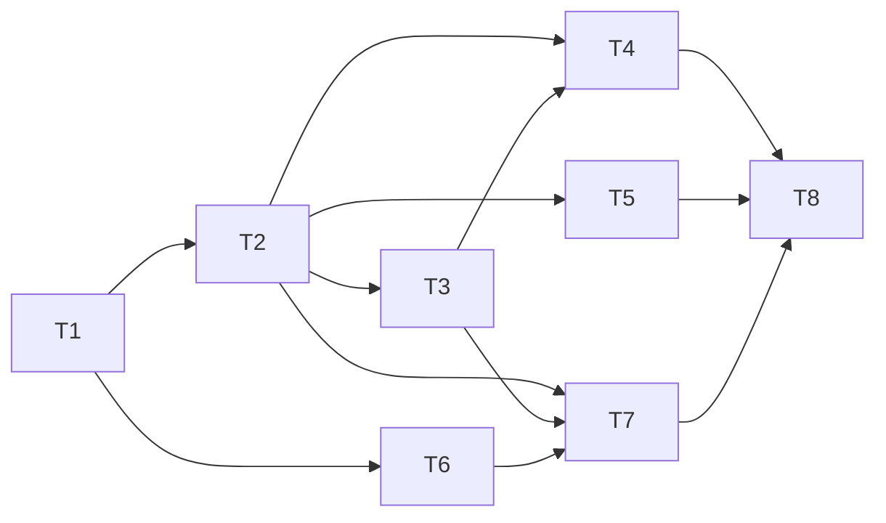

---
作者：@Ray
创建日期：2026-05-30
最后更新：2026-05-30
文档状态：草稿
---

# 任务列表：observability

## 依赖速览
> 以各任务 inline「同 spec 依赖」字段为准；跨 spec 依赖以 README「依赖」列为准。
T1 →（T2, T6 并行）→（T3, T5 并行）→（T4, T7 并行）→ T8

## 任务依赖图
> 由各任务 inline「同 spec 依赖」字段汇总，仅供速览；以 inline 为准。


并行组：
- Group A：T1
- Group B：T2, T6
- Group C：T3, T5
- Group D：T4, T7
- Group E：T8

里程碑（存在可独立交付/演示的切点，故标）：
- **M1 · 可用的脱敏分级日志门面（T1–T5）**：门面 + 强制脱敏 + 级别管控 + ConsoleSink 落地后，全模块即可 `import 'package:dayz/observability/observability.dart'` 记脱敏、分级日志（console 输出）。对下游（`auto-save-draft` R5、`media-storage` NF5 复用 `redactAbsolutePath`）产生可见价值，可独立交付。
- **M2 · 落盘 + 轮转 + 降级 + 真机核查（T6–T8）**：脱敏明文落盘 + size 轮转 + 失败降级 + Debug Home 多端核查入口。

-----

- [x] T1 · 引入 logging 依赖 + observability 模块脚手架 + 同 commit 更新 CLAUDE.md 架构大图 + README 立项

**同 spec 依赖：** 无 ｜ **跨 spec 依赖：** app-scaffold：`lib/` 骨架 + Debug Home + pubspec 框架（已归档完成）｜ **关联需求：** NF5（仅引入 logging、无遥测包）｜ **依据设计：** D1, D4（模块边界 / 新模块层）｜ **可改文件：** `pubspec.yaml`、`pubspec.lock`、`CLAUDE.md`、`specs/README.md`

### 背景
为 observability 模块奠基：引入 dart.dev `logging` 依赖、建 `lib/observability/` 模块目录、把"新模块层"同 commit 写进 `CLAUDE.md` 架构大图（按其「维护本文件」节，新模块层是结构性约定的更新触发点），并把 README 立项行状态从「草稿」翻为「进行中」。

### 实施
1. `pubspec.yaml` 的 `dependencies` 增加 `logging: ^<最新稳定>`（仅此一个新增依赖，不引入任何遥测 / 网络上报包，咬合 NF5）。
2. `flutter pub get` 同步 `pubspec.lock`。
3. `CLAUDE.md`：在「架构大图」的模块清单与分层说明中加入 `observability/`——定位为"零依赖横切诊断底座，谁都可依赖、它不依赖任何业务模块"，并点明依赖方向（业务 → AppLogger 门面）。
4. `specs/README.md`：把 observability 立项行状态由「草稿」改为「进行中」（行本身在起草本 spec 时已加入）。

### 验收标准（做完即止）
- `flutter pub get` 退出 0，`logging` 出现在解析后的依赖树（自动）。
- `flutter analyze` 无新增告警（自动）。
- `specs/` 相对链接无死链（自动）。
- `CLAUDE.md` 架构大图已列入 `observability/` 模块及其零依赖底座定位（人工 @Ray）。

### 禁止
- 不引入除 `logging` 外的任何新增运行时依赖（尤其任何遥测 / crash 上报包，违反 NF5）。
- 不在本任务写任何 `lib/observability/*.dart` 实现（归 T2 起）。

### 验收方式
- 自动：
  ```bash
  flutter pub get
  flutter pub deps --style=compact | grep -E '(^|\s)logging '   # 断言 logging 进入依赖树（独立来源，非被改文件自身）
  flutter analyze
  bash spec-kit/scripts/check_dead_links.sh specs
  ```
- 人工（仅当无法自动化时）：
  - `CLAUDE.md` 架构大图含 `observability/` 模块层与"零依赖横切底座"定位（核查人 @Ray）。

### 验收记录
```
日期：—
自动：—
人工：待确认（核查人 @Ray）
```

-----

- [x] T2 · LogLevel + LogRecord + LogSink 抽象接口（预留加密扩展点）

**同 spec 依赖：** T1 ｜ **跨 spec 依赖：** 无 ｜ **关联需求：** R1, R5 ｜ **依据设计：** D1, D4, D5 ｜ **可改文件：** `lib/observability/log_level.dart`、`lib/observability/log_record.dart`、`lib/observability/log_sink.dart`、`test/observability/log_level_test.dart`

### 背景
定义模块的三块地基类型：① `LogLevel`（FINE/INFO/WARNING/SEVERE 有序级别 + `defaultLevelFor(bool releaseMode)` 纯函数：release→INFO、debug→FINE，供 D5 可测分流）；② `LogRecord`（结构化记录：级别 + event 码 + 类型化安全字段 map + 时间戳 + 可选脱敏后 message）；③ `LogSink` 抽象接口（`void add(LogRecord redacted)`，契约注明"只接收已脱敏记录"，预留加密扩展点）。
职责边界：本任务只定义类型与纯函数，不实现门面（T4）、不实现任何具体 sink（T5/T7）。

### 实施
1. `log_level.dart`：定义有序 `LogLevel`，实现 `defaultLevelFor(bool releaseMode)` 纯函数（true→INFO、false→FINE），实现 `isLoggable(current, candidate)` 比较。
2. `log_record.dart`：按 design「门面对外 API 契约」定义 `LogRecord { LogLevel level; String event; DateTime ts; String? message; Map<String,Object?> fields }`——`event` 为自由 `String`、`fields` value 收窄为安全标量（`String`/`num`/`bool`/`enum`，不接受 `dynamic` 原始对象 / 字节）、`ts` 时间戳由门面盖戳（T4 注入时钟）。
3. `log_sink.dart`：按契约定义抽象 `LogSink { void add(LogRecord redacted); Future<void> flush(); Future<void> close(); }`，文档注释写明"实现方收到的 record 已由门面脱敏；`add` MUST NOT 抛；`flush`/`close` 供 await 异步落盘；新增加密 sink 实现此接口即为 D3 升级路径"。

### 验收标准（做完即止）
- `defaultLevelFor(true) == INFO`、`defaultLevelFor(false) == FINE`（自动）。
- `LogLevel` 比较满足 FINE < INFO < WARNING < SEVERE（自动）。
- 可在测试内实现一个 `FakeSink implements LogSink`（含 `add`/`flush`/`close`）并接收 `LogRecord`，断言其 `add` 被调用、收到的 record 含 level/event/ts/message/fields 且字段值正确（自动，验抽象契约可用）。

### 验收方式
- 自动：
  ```bash
  flutter test test/observability/log_level_test.dart
  flutter analyze
  ```
  （断言 `defaultLevelFor` 返回值、级别序、FakeSink 收到的 record 值——验值/行为，不 grep 源码）

### 验收记录
```
日期：—
自动：—
人工：N/A
```

-----

- [x] T3 · Redactor 脱敏中间件 + redactAbsolutePath 纯函数（脱敏真源单点）

**同 spec 依赖：** T2 ｜ **跨 spec 依赖：** 无 ｜ **关联需求：** R2, NF1 ｜ **依据设计：** D2 ｜ **可改文件：** `lib/observability/redaction.dart`、`test/observability/redaction_test.dart`

### 背景
脱敏的工具层与中间件层（D2 第②③层）：① `redactAbsolutePath(String) -> String` 纯函数（脱敏真源单点，供 `media-storage` NF5 复用）；② `Redactor`：对一条 `LogRecord` 做脱敏——绝对路径前缀 → 相对 / `<app-private>` 占位、命中 `key=/password=/secret=/token=/derived` 的值 → `***`、`content_json`/`content_plain` 字段 → `<redacted:len=N>`。
归属说明：脱敏的"结构层"（门面只暴露类型化 API、不暴露 `log(Object)`）在 T4 门面落地；本任务只产出可独立验证的纯函数与 Redactor 变换。

### 实施
1. `redactAbsolutePath`：把已知绝对前缀（`/var/mobile/Containers/...`、`/data/data/...` 等）后的应用私有相对段取出（如 `.../Documents/media/a.bin` → `media/a.bin`）；未知绝对前缀（以 `/` 开头且不匹配已知模式）→ `<REDACTED_ABS>` 保守兜底；相对路径原样返回。
2. `Redactor.redact(LogRecord) -> LogRecord`：对 message 与 fields 应用上述路径脱敏 + 敏感键掩码 + 正文字段替换。

### 验收标准（做完即止）
- `redactAbsolutePath('/var/mobile/Containers/Data/Application/X/Documents/media/a.bin')` 结果不含任何绝对前缀、为相对/占位形（自动）。
- 未知绝对前缀（如 `/private/var/foo`）→ `<REDACTED_ABS>`；相对路径 `media/a.bin` 原样返回（自动）。
- **fields 路径**：`Redactor.redact` 对含敏感键（`key`/`secret` 等）/ 含 `content_json` 字段 / 含绝对路径 value 的 record，输出敏感键值置 `***`、`content_json` → `<redacted:len=N>`、绝对路径相对化（自动）。
- **message 路径**：对 message 自由文本含 `secret=xxx` 值位模式 / 含绝对路径的 record，输出 message 中敏感值位被 `***`、绝对路径被相对化/占位（自动）。
- 两路径输出均不含原密钥字节、不含正文原文（自动，咬合 NF1）。

### 验收方式
- 自动：
  ```bash
  flutter test test/observability/redaction_test.dart
  ```
  （真实输入→输出值断言：验脱敏后的字符串/字段值，不 grep 源码字面量）

### 验收记录
```
日期：—
自动：—
人工：N/A
```

-----

- [x] T4 · AppLogger 门面：级别管控 + 强制脱敏中间件 + 惰性闭包 API + sink 列表 + barrel 导出

**同 spec 依赖：** T2, T3 ｜ **跨 spec 依赖：** 无 ｜ **关联需求：** R1, R2, NF1, NF4 ｜ **依据设计：** D1, D2, D4, D5 ｜ **可改文件：** `lib/observability/app_logger.dart`、`lib/observability/observability.dart`、`test/observability/app_logger_test.dart`、`test/observability/lazy_level_test.dart`

### 背景
门面是级别 / 脱敏 / 输出目标的唯一信任根：① 持有 sink 列表与生效级别（默认 `defaultLevelFor(kReleaseMode)`，`setLevel` 运行时可调）；② 暴露分级 API 与惰性闭包 `logFine(() => '...')` + `isLoggable`；③ 每条 record 落任一 sink 前**强制过 T3 的 Redactor**——各 sink 只收已脱敏记录；④ MUST NOT 暴露吞任意对象的 `log(Object)`；⑤ barrel `observability.dart` 对外只导出 `AppLogger` + `LogLevel`，其余为模块内实现细节。

### 实施
1. `app_logger.dart`：实现门面（单例 + 可注入 sink 列表与**可注入时钟** `DateTime Function() now`，默认 `DateTime.now`，便于测试），级别守卫短路 + 门面盖时间戳（单一来源）构造 LogRecord + Redactor 强制脱敏后分发到 sinks。**构造即挂 `ConsoleSink`（零配置可用，D10）**；提供异步 `attachFileSink()` 注册 file sink，attach 前的日志只走 console、不抛、不丢。
2. 惰性闭包 API（每级别均有重载）：低于生效级别时不调用 builder、不格式化、不脱敏。
3. `observability.dart`：barrel，仅导出门面与 LogLevel。

### 验收标准（做完即止）
- 注入 `FakeSink`，记 ≥ 生效级别日志后 FakeSink 收到对应已脱敏 record；< 生效级别的不分发（自动，对应 R1）。
- 含绝对路径 / 假密钥字段的日志经门面后，FakeSink 收到的 record 已脱敏（自动，对应 R2/NF1：门面强制脱敏，sink 无未脱敏机会）。
- `logFine(() => sideEffect())` 在级别 = INFO 时 `sideEffect` 计数器为 0（闭包未求值）；级别 = ALL/FINE 时计数器 +1（自动，对应 NF4）。
- barrel 不导出 `Redactor`/`RotatingFileSink` 等实现细节（自动：import barrel 后引用这些符号编译失败的 negative 测试，或断言公开 API 表面）。
- 零配置可用：门面构造后未 `attachFileSink` 即记日志，注入的 console 捕获通道收到记录、调用不抛（自动，对应 D10/R4）。
- 时间戳单一来源：注入固定时钟后，分发到 FakeSink 的 `record.ts` 等于注入值（自动，对应 API 契约时间戳）。

### 禁止
- 门面不得提供接收 `Object`/`dynamic` 原始对象的日志方法（防绕过类型脱敏）。

### 验收方式
- 自动：
  ```bash
  flutter test test/observability/app_logger_test.dart
  flutter test test/observability/lazy_level_test.dart
  ```
  （断言：分发/过滤行为、门面输出已脱敏、惰性闭包按级别求值与否——均验行为）

### 验收记录
```
日期：—
自动：—
人工：N/A
```

-----

- [x] T5 · ConsoleSink（零依赖底座 sink）

**同 spec 依赖：** T2 ｜ **跨 spec 依赖：** 无 ｜ **关联需求：** R1, R5, NF3 ｜ **依据设计：** D4, D7 ｜ **可改文件：** `lib/observability/console_sink.dart`、`test/observability/console_sink_test.dart`

### 背景
零依赖的 console 输出 sink（实现 `LogSink`），是降级目标（D7：file sink 失败时降级到 console）。只依赖 `dart:developer`/`dart:io` 的标准输出，不 import 任何业务模块。

### 实施
1. `console_sink.dart`：实现 `ConsoleSink implements LogSink`，把已脱敏 record 格式化为单行输出到控制台。
2. 输出本身不得抛异常上抛（与 D7 降级目标一致）。

### 验收标准（做完即止）
- `ConsoleSink.add(record)` 把 record 的级别 / event / 字段写出（自动：注入可捕获的输出通道断言写出内容；或用 `IOOverrides`/可替换 writer 断言收到行）。
- `add` 对正常 record 不抛异常（自动）。

### 验收方式
- 自动：
  ```bash
  flutter test test/observability/console_sink_test.dart
  ```
  （用可替换的输出 writer 捕获并断言写出的行内容——验行为，不 grep 源码）

### 验收记录
```
日期：—
自动：—
人工：N/A
```

-----

- [x] T6 · LogPaths：ApplicationSupport/logs/ 解析（备份范围外，暴露日志根目录常量）

**同 spec 依赖：** T1 ｜ **跨 spec 依赖：** 无 ｜ **关联需求：** R3, NF6 ｜ **依据设计：** D8 ｜ **可改文件：** `lib/observability/log_paths.dart`、`test/observability/log_paths_test.dart`

### 背景
解析日志落盘根目录 = `getApplicationSupportDirectory()` 下 `logs/`（与 db/media 备份收录根物理隔离、在备份扫描范围之外）；暴露日志根目录常量 / 子段名供 `backup-full-snapshot` 排除（D8）。

### 实施
1. `log_paths.dart`：`logsSubdir` 常量（如 `'logs'`）+ `resolveLogsDir(Directory appSupport) -> Directory` 纯函数（拼接 `appSupport/logs`），与实际 `path_provider` 调用分离以便可测。
2. 暴露 `logsSubdir` 供下游 backup 排除引用。

### 验收标准（做完即止）
- `resolveLogsDir(fakeAppSupport)` 返回路径 = `<fakeAppSupport>/logs`，且其前缀为传入的 ApplicationSupport（自动，对应 NF6：与备份收录根隔离）。
- `logsSubdir` 常量值稳定可被外部引用（自动：断言其值，非 grep 定义处）。

### 验收方式
- 自动：
  ```bash
  flutter test test/observability/log_paths_test.dart
  ```
  （传入 fake appSupport 目录，断言解析出的 logs 目录路径与前缀——验值/行为）

### 验收记录
```
日期：—
自动：—
人工：N/A
```

-----

- [x] T7 · RotatingFileSink：脱敏明文落盘 + size 轮转 + 失败降级（单写者异步，不进 DB 事务）

**同 spec 依赖：** T2, T3, T6 ｜ **跨 spec 依赖：** 无 ｜ **关联需求：** R3, R4, NF2, NF3 ｜ **依据设计：** D3, D6, D7, D9 ｜ **可改文件：** `lib/observability/rotating_file_sink.dart`、`lib/observability/log_rotation.dart`、`test/observability/rotating_file_sink_test.dart`、`test/observability/sink_failure_test.dart`

### 背景
脱敏明文落盘 sink（实现 `LogSink`）：单写者异步追加写（避免每条 flush、串行化解轮转竞态，D9），size 轮转（单文件 ≤ 1 MiB、保留 3 份、总量 ≤ ~3 MiB，常量集中在 `log_rotation.dart`，D6/NF2），IO/轮转失败吞掉降级到 console + 降级告警（防递归）+ 计数（D7/NF3），绝不进任何 DB 事务、绝不向调用方抛。本里程碑只落明文（D3，加密为后置扩展点）。
归属说明：sink 收到的 record 已由门面脱敏（T4），本 sink 不重复脱敏、只负责落盘 + 轮转 + 降级。

### 实施
1. `log_rotation.dart`：容量常量（softMaxBytes=1 MiB、maxFiles=3、hardCapBytes≈3 MiB、**queueCapacity=4096 条**）+ 轮转决策纯函数（给定当前文件大小/份数 → 是否轮转、删哪些）。
2. `rotating_file_sink.dart`：单写者串行**有界队列**异步 append（容量 queueCapacity，**溢出丢弃最旧** + 计一次降级告警）；达软上限 rename `app.log`→`app.log.1`…、超份数删最旧；IO/轮转异常捕获 → 降级仅 console + 一次"降级，原因 X"告警（告警 MUST NOT 再触发落盘）+ 降级计数 +1；暴露 `flush()` / `close()` Future（await 异步落盘完成）；写入注入点支持可替换文件系统/可失败 sink 以便测试。

### 验收标准（做完即止）
- 持续写入超过 `softMaxBytes×(maxFiles+1)` 后 `await sink.flush()`，再断言：日志文件数 ≤ `maxFiles`、每文件 ≤ `softMaxBytes`、总字节 ≤ `hardCapBytes`、最旧已删、最新内容可读（自动，对应 NF2；先 await flush 消除写后未落地竞态）。
- 注入"写入必失败"的底层 IO：`RotatingFileSink.add` 不抛、降级计数 +1、console 收到降级告警、告警未再触发落盘（自动，对应 R4/NF3）。
- 队列溢出（写入速率超 `queueCapacity` 来不及 flush）：丢弃最旧、降级计数 +1，调用方不抛、不阻塞（自动，对应 D9/NF3）。
- 落盘内容为传入的（已脱敏）明文，含绝对路径的输入 `await flush()` 后读回不含绝对前缀（自动，端到端佐证 NF1 在落盘路径成立）。

### 禁止
- 不在本 sink 内做任何 DB/Drift 调用（NF3：日志写入不进 DB 事务）。
- 不实现加密落盘（D3：加密为后置扩展点，本里程碑明文）。

### 验收方式
- 自动：
  ```bash
  flutter test test/observability/rotating_file_sink_test.dart
  flutter test test/observability/sink_failure_test.dart
  ```
  （用临时目录真实落盘断言轮转份数/总量上界；注入失败 IO 断言降级行为与计数——均验行为）

### 验收记录
```
日期：—
自动：—
人工：N/A
```

-----

- [x] T8 · Debug Home observability demo 入口（追加 demos 末尾，触发各级别/强制轮转/查看降级状态）

**同 spec 依赖：** T4, T5, T7 ｜ **跨 spec 依赖：** 无 ｜ **关联需求：** R6, NF7 ｜ **依据设计：** D4, D5, D7 ｜ **可改文件：** `lib/demo/observability_demo.dart`、`lib/demo/demo_entry.dart`、`test/demo/observability_demo_test.dart`

### 背景
Debug Home 入口：装配门面 + ConsoleSink + RotatingFileSink，提供按钮触发各级别日志、强制轮转、查看 file sink 降级计数/状态，供 iOS/Android 真机核查（NF7）。按 `lib/demo/demo_entry.dart` 约定**在 demos 列表末尾追加**，不修改 `DemoEntry` 字段。

### 实施
1. `observability_demo.dart`：一个 demo 页，含触发 FINE/INFO/WARNING/SEVERE、强制轮转、显示降级计数与当前级别、运行时切级别的控件。
2. `demo_entry.dart`：在 `demos` 列表**末尾**追加一条 `DemoEntry`（不改字段、不插中间）。

### 验收标准（做完即止）
- `demos` 列表末尾新增 observability 入口、`DemoEntry` 字段未改动（自动：`test/demo/observability_demo_test.dart` 断言 `demos.last` 为 observability 入口——按 `demos.last` 而非临时 title 文案，避免脆弱）。
- 进入 demo 页可构建、触发各级别按钮不抛异常（自动，widget 测）。
- iOS 13+ / Android 8+ 真机各跑一次：触发若干日志 + 强制轮转，确认日志文件生成、轮转份数正确、App 未崩溃（人工 @Ray，对应 NF7）。

### 禁止
- 不修改 `DemoEntry` 模型字段、不在 demos 列表中间插入（CLAUDE.md 约定）。
- demo 页不显示任何未脱敏内容（不构造含真实密钥/正文的日志做演示）。

### 验收方式
- 自动：
  ```bash
  flutter test test/demo/observability_demo_test.dart   # 断言 demos.last 为 observability 入口、DemoEntry 字段未改、demo 页可构建
  flutter analyze
  ```
- 人工（仅当无法自动化时）：
  - iOS 13+ / Android 8+ 真机：触发日志 + 强制轮转，日志文件生成、轮转份数正确、App 未崩溃（核查人 @Ray）。

### 验收记录
```
日期：—
自动：—
人工：待确认（核查人 @Ray）
```
